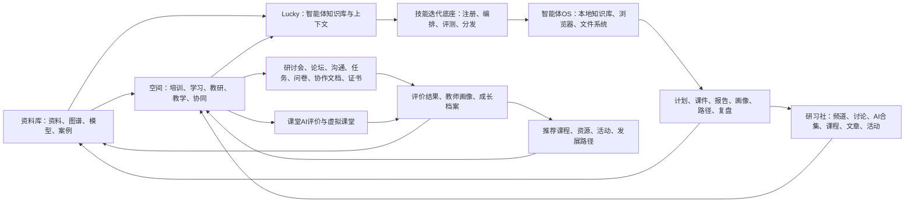
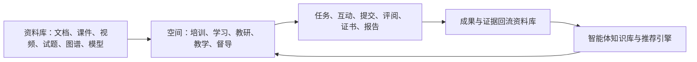
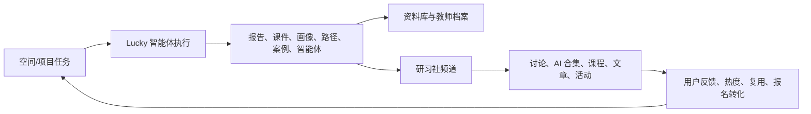

# AI原生平台教师发展与竞品战略评估报告

面向：内部战略评审  
版本：2026-08-28  
口径说明：本文统一使用“AI原生平台”作为项目名称。报告依据项目方案文档、前端功能模块与公开竞品资料整理，重点服务产品定位、市场打法和建设优先级判断。

## 一、核心结论

AI原生平台不应被定位为单点 AI 备课工具，也不适合与飞象老师、星火教师助手、九章爱学、学科网 AI 小博士在“谁更会生成教案/课件/习题”这一层面直接竞争。结合当前空间、资料库、Lucky 与研习社模块设计，平台真正的战略价值应重新表述为：空间是开展实际业务和多人协同的地方，承载培训、学习、教研、教学、督导和社区共创，并通过功能权限、数据权限、线上研讨会、论坛、即时沟通、任务、空间日历、问卷和多人文档编辑支撑协作；资料库是平台的资料与知识资产底座，承载文档、课件、图片、音视频、白板、笔记、试题、知识图谱、能力模型等多类型资料，既供人在空间中导入和使用，也供智能体作为知识库和上下文使用；Lucky 承载智能体、智能体小队、自动化、项目、资源库和技能市场；研习社承载频道化社区、讨论、AI 合集、课程、文章、活动和案例传播。四者串联后，平台才能把教师培训从“一次性交付”升级为“持续学习、持续共创、持续运营”的平台服务。

从竞品格局看，国内多数教师 AI 产品强在“教师个人提效”和“教学内容生成”，例如备课、课件、组卷、批改、课堂活动等；超星 EduClaw 更接近“教育智能体执行平台”，具备较强平台化参考价值；腾讯 LearnBuddy 更接近“专家同行的 AI 自主学习平台”，强在腾讯生态、专家分身、AI 伴学、AI 制课和高校教学科研场景；希沃的优势在白板、硬件、课堂反馈和校内教学场景；WorkBuddy、TraeWork、QwenWork 代表通用办公 Agent 对报告、PPT、数据分析、调研、网页等交付物的冲击；Claude for Teachers 则体现了海外在教师专属技能、课程标准和教学法支持上的方向。

AI原生平台的差异化不在单个 AI 生成能力，而在“组织业务可运营、智能体任务可执行、内容社区可持续、过程数据可留痕、评价档案可沉淀、推荐服务可回流、客户方案可复制”。围绕这一主线，平台已经形成一组关键单点深能力：客户端模式下的本地知识库可为智能体提供私域资料供给；本地浏览器智能体调用可让智能体执行跨网页、跨系统任务；智能体文件系统可让智能体管理、生成和复用项目文件；教师课堂 AI 评价可把教师和学生的课堂行为分析纳入发展证据；虚拟课堂可对标 OpenMAIC 类多智能体互动课堂方向，形成模拟授课、研修演练和课堂互动训练场。这些能力共同指向一个更重要的判断：平台正在从“AI 应用集合”走向“教师发展场景下的智能体 OS”。

更底层、更关键的是，平台架构必须支持单点技能的持续迭代。备课、组卷、本地浏览器操作、证书生成、项目复盘等高频能力，以及支撑课堂 AI 评价和虚拟课堂运行的观察分析、互动分析、教学演练脚本、试讲反馈等能力，都不应被做成一次性固定功能，而应被抽象为可注册、可编排、可评测、可灰度、可复用、可上架、可按租户定制的技能单元。课堂 AI 评价和虚拟课堂本身属于平台级场景/模块，不宜作为技能分类；技能市场沉淀的是支撑这些场景运行的可调用能力。只有底座支撑技能持续迭代，平台才能不断吸收竞品的高频工具能力，也才能把客户项目中的交付经验沉淀为下一次可调用的组织能力。

基于这个底座，平台不宜只销售“通用平台”，而要持续面向高等教育、职业教育、基础教育，以及不同学科、不同学段形成解决方案包，并通过样板间落地。底座解决“能力能不能持续生长”，解决方案解决“客户能不能直接采购和使用”，样板间解决“客户能不能快速理解、试用、复制和交付”。这也是从产品能力走向规模化市场打法的关键路径。

参考附件中对 AI 原生模式的判断，真正的 AI 原生不是在传统系统旁边增加一个问答入口，也不是取消原有菜单、表单和流程，而是在保留 GUI 图形化业务入口的基础上，增加 LUI 自然语言目标入口。GUI 负责稳定、可控、可审计的业务操作，LUI 负责目标表达、任务拆解、智能体调用和持续跟进，人负责判断、确认和风险把关。这意味着平台建设重心要从单一菜单功能堆叠，升级为“GUI + LUI”双入口：既保留成熟业务流程，又让业务能力可被智能体理解、调用、编排和追踪。

建议将平台战略定位明确为：

> AI原生平台面向教师发展和培训运营，以空间承载真实业务、多人协同和权限治理，以资料库承载全类型资料和智能体知识库，以 Lucky 作为智能体执行工作台，以单点技能持续迭代底座支撑技能注册、编排、评测和分发，以客户端本地知识库、本地浏览器调用和智能体文件系统构建智能体 OS 能力，以课堂 AI 评价和虚拟课堂补足教学过程数据与训练场景，以研习社作为内容社区和成果传播阵地，以高教、职教、基教及不同学科学段解决方案和样板间形成可复制交付，以任务、评价、档案、推荐和证书形成闭环，帮助培训机构、组训机构、参训机构和教师个人完成可组织、可执行、可传播、可追踪、可评价、可沉淀、可推荐的教师发展服务。

## 二、平台定位与能力结构

### 2.1 平台定位

项目已经具备明显的平台底座特征，而不是普通内容工具特征。平台能力可以概括为九层：

| 层级 | 核心能力 | 战略价值 |
|---|---|---|
| 业务空间层 | 场景模板、空间、主题、首页、资料区、结果区、阶段状态、角色权限、数据权限、成员进入方式、工具配置、线上研讨会、论坛、即时沟通、任务、空间日历、问卷、多人文档编辑 | 把培训、学习、教研、教学等真实业务放进可运行、可协同、可控权、可复用的工作场 |
| 资料资产层 | 个人资料库、组织资料库、文件夹、标签、快捷标签、资料解析、资料导入、知识图谱、能力模型、证书归档、Lucky 产出另存 | 把全类型资料沉淀为人可用、空间可调用、智能体可引用的知识资产 |
| 技能迭代底座层 | 技能注册、技能编排、提示词/模板管理、工具调用协议、版本管理、灰度发布、评测集、效果反馈、租户定制、技能市场 | 让备课、组卷、浏览器操作、证书生成、项目复盘，以及课堂观察分析、教学演练反馈等支撑性能力可以持续迭代，而不是一次性固定功能 |
| AI 执行层 | Lucky 工作模式、智能体、智能体小队、自动化、项目、资源库、市场、课程创作、资料解析、知识问答、报告生成、推荐推送 | 让 AI 不只回答问题，而是承担任务拆解、资料检索、内容生成、质量检查、协作汇总和业务复盘 |
| 智能体 OS 层 | 客户端本地知识库、本地浏览器智能体调用、智能体文件系统、工具权限、执行审计、项目产物归档 | 让智能体拥有可持续工作环境，能够使用本地知识、调用网页系统、管理文件和沉淀产物 |
| 教学现场与仿真层 | 教师课堂 AI 评价、教师和学生课堂行为分析、听评课证据链、虚拟课堂、AI 学生、AI 助教、课堂演练 | 把教师发展连接到真实课堂和模拟训练场景，形成更高价值的教育垂直能力 |
| 解决方案与样板间层 | 高等教育、职业教育、基础教育，不同学科、学段、岗位和项目类型的解决方案包；样板空间、样板课程、样板研习社、样板报告 | 把底座能力封装为客户可理解、可试用、可采购、可复制的业务方案 |
| 内容社区层 | 研习社、频道、讨论区、AI 合集、AI 工坊、智能体、灵感市集、课程、文章、活动、投稿、订阅 | 把培训成果、AI 实践、优秀案例和专家经验转化为可传播、可互动、可复用的持续运营内容 |
| 数据资产层 | 空间行为数据、学习进度、任务提交、评价记录、教师画像、成长档案、推荐反馈、运营埋点 | 形成可复用、可解释、可运营的教师发展数据资产 |

平台模块和规划能力能够支撑上述定位，包括：空间、资料库、知识空间、知识图谱、课程创作中心、Lucky、智能体、智能体小队、技能包、自动化、技能市场、客户端本地知识库、本地浏览器智能体调用、智能体文件系统、教师课堂 AI 评价、虚拟课堂、消息、任务、教师画像、教师发展、评价方案、教师评价、能力模型、资源推荐、证书模板、证书发放、档案提交、研习社、模型统计、智能体配额、解决方案、套餐管理、租户管理、应用中心、场景模板、样板间/样板空间、线上研讨会、论坛、即时沟通、空间日历、问卷、多人协作文档、三方对接等。

### 2.2 平台闭环

平台应围绕以下闭环展开产品叙事：

这个闭环解决的是传统教师培训和教研长期存在的断点：

| 传统断点 | 平台解决方式 |
|---|---|
| 培训只管报名和结业，过程不可见 | 空间、任务、学习、互动、成果提交和消息提醒形成过程留痕 |
| 多角色协作依赖群聊和临时文档，权限边界不清 | 空间通过角色权限、数据权限、线上研讨会、论坛、即时沟通、空间日历、任务、问卷和多人文档编辑形成统一协同场 |
| 教研活动成果散落在文档和群聊中 | 资料库、知识空间、研习社频道和成果档案沉淀可复用内容 |
| 教师评价依赖人工汇总，口径不统一 | 能力模型、评价方案、证据规则和评审流程统一标准 |
| 课堂现场数据缺失，培训评价与真实教学脱节 | 教师课堂 AI 评价、听评课证据和虚拟课堂训练记录进入教师画像和成长档案 |
| 教师成长记录分散，延续培训难以精准匹配 | 教师画像、档案版本和推荐引擎形成发展诊断 |
| 培训机构交付依赖个人经验，难复制 | 解决方案、套餐、租户和场景模板形成可复制交付包 |
| 培训结束后热度下降，社群难持续 | 研习社把讨论、AI 工坊作品、智能体、灵感文章、课程和活动沉淀到频道，形成持续运营阵地 |

### 2.3 空间与资料库的底座定位

空间和资料库是平台最基础的两类能力，重要性高于普通功能模块。

| 底座能力 | 功能设计 | 平台作用 | 解决的问题 |
|---|---|---|---|
| 空间 | 支持教学、教研、督导、培训、社区共创、自定义等场景类型；每类场景可配置首页、主题页、资料区、结果区、阶段状态、角色权限、数据权限、成员进入方式、工具区和内置智能体 | 承载真实业务发生过程，是培训、学习、教研、教学等活动的操作场和协同场 | 解决传统业务分散在群聊、网盘、表格和线下流程中，过程不可见、权限不可控、成果难归档的问题 |
| 空间协同 | 支持线上研讨会、论坛、即时沟通、任务下达、空间日历、各类问卷、各类文档多人编辑 | 支撑管理员、专家、导师、教师、学员、评审者、客户等多角色在同一业务场内协作 | 解决会议、讨论、任务、日程、问卷和文档协作分散在不同工具中，信息割裂、过程难留痕的问题 |
| 空间权限 | 支持人员在空间内的功能权限和数据权限控制，可按角色、成员、业务阶段、资料范围和工具能力配置 | 让同一空间既能开放协作，又能控制不同角色能看什么、做什么、改什么、导出什么 | 解决跨机构、跨学校、跨角色协作时数据越权、误操作、材料外泄和责任不清的问题 |
| 场景模板 | 内置教学场景、教研场景、督导检查、组织培训、课程创作中心、社区共创等模板；模板包含目录结构、工具组合、角色模型和状态规则 | 把成熟业务经验沉淀为可复制空间 | 解决交付依赖项目经理个人经验、不同项目反复从零搭建的问题 |
| 资料库 | 支持个人资料库、组织资料库、文件夹、标签、快捷标签、拖拽整理、上传/粘贴、本地目录映射、AI 解析状态、最近使用、搜索和多种预览 | 承载平台所有资料资产，是业务资料、课程资源、成果证据和智能体知识的统一来源 | 解决资料散落、版本混乱、难检索、难复用、难作为 AI 可信上下文的问题 |
| 资料库到空间 | 空间内可从资料库导入资料，保留目录结构；知识图谱和能力模型可从个人库/组织库选择、绑定或导入 | 让资料库资产进入具体业务现场 | 解决“有资料但业务用不上”“资料只能下载不能参与流程”的问题 |
| 空间到资料库 | Lucky 产出、项目成果、证书记录、知识图谱、能力模型等可沉淀回资料库 | 让业务过程反哺组织知识资产 | 解决培训或教研结束后成果留在临时空间、聊天记录或个人电脑中的问题 |

因此，空间和资料库之间应形成双向关系：资料库为业务空间供给材料、知识图谱、能力模型和智能体上下文；空间在业务运行中产生作业、讨论、评价、报告、证书和优秀案例，再回流资料库成为新的可复用资产。

这意味着平台的底层产品叙事应从“有空间、有资料库”升级为：

> 空间让业务可运行、人员可协同、权限可控制、过程可留痕；资料库让知识可复用。空间沉淀过程数据，资料库沉淀长期资产；空间面向人组织业务和协作，资料库同时面向人和智能体提供可信资料。

### 2.4 Lucky 与研习社的真实定位

结合当前功能设计，Lucky 和研习社不应被简单写成“AI 助手”和“社区”。二者分别承担平台的执行引擎和运营引擎：

| 模块 | 当前功能设计 | 战略定位 |
|---|---|---|
| Lucky | 支持学习办公与编程两类工作模式，包含新任务、自动化、智能体、项目、资源库、市场等导航；内置高校教师智能体、中小学教师智能体、教师能力画像、AI 选学培训、班主任、督学、智慧教学平台运营等教育智能体；支持智能体小队、项目上下文、技能包、最佳实践、企业智能体和资源另存，并逐步接入客户端本地知识库、本地浏览器调用和智能体文件系统 | 不是普通问答入口，而是教师发展业务的智能体工作台和智能体 OS 雏形，负责把计划、备课、研修、画像、评价、督导、报告、资源归档等任务执行出来 |
| 研习社 | 顶部承载 AI 游乐园、课程、知识、模板、频道、AI 会员、活动；频道内包含首页、讨论区、AI 合集、课程、文章、活动；AI 合集细分 AI 工坊、智能体、灵感市集；后台主题资源可映射为前台频道内容 | 不是普通论坛，而是培训项目和教师发展成果的内容社区运营层，负责把项目成果、AI 实践、优秀案例、课程活动和专家方法持续传播、互动和复用 |

二者的关系应设计为前后贯通：

因此，平台叙事需要从“教师发展闭环”进一步升级为“空间业务场 + 资料知识库 + 智能体执行生态 + 研习社持续运营阵地”。这也是AI原生平台区别于单点 AI 备课工具和通用办公 Agent 的核心所在。

### 2.5 单点深能力与智能体 OS 方向

以下能力属于平台差异化主线，分别补齐智能体运行所需的知识、工具、文件、感知和仿真能力。

| 能力 | 功能价值 | 对教师发展和培训业务的意义 |
|---|---|---|
| 客户端本地知识库供给智能体 | 在客户端模式下，将本地资料、私域文档、项目文件和敏感材料作为智能体上下文 | 解决机构和教师不愿把资料全部上云的问题，适合校本资料、评审材料、课堂记录、合同方案、内部标准等敏感场景 |
| 本地浏览器智能体调用 | 让智能体在授权范围内调用本地浏览器，访问网页、检索资料、填写系统、跨页面执行任务 | 解决培训运营中跨系统操作多、网页资料多、外部平台割裂的问题，可用于报名数据核对、公开资料采集、教务系统辅助操作、客户资料整理等 |
| 智能体文件系统 | 为智能体提供类似工作目录的文件读写、整理、生成、复用和版本化能力 | 让智能体产出的方案、课件、表格、报告、证书、评价材料不再停留在聊天记录中，而是成为可管理、可归档、可二次调用的项目资产 |
| 教师课堂 AI 评价 | 对教师课堂行为、学生课堂行为、互动结构、参与度、提问反馈、课堂节奏等进行分析和证据化 | 把真实课堂过程纳入教师发展评价，补齐“只看培训作业、不看教学现场”的断点，可服务听评课、督导、教研改进和教师画像 |
| 虚拟课堂 | 构建可模拟授课、互动问答、课堂决策和多智能体学习参与的训练环境，对标 OpenMAIC 类多智能体互动课堂方向 | 为教师提供低风险练习场，用于新教师试讲、AI 融合教学演练、课堂问题处置训练、教研共创和课程方案验证 |

这组能力的战略意义在于，AI原生平台的智能体不再只是“云端对话框”，而是逐步具备完整工作环境：本地知识库提供私域知识供给，本地浏览器提供外部系统和网页工具调用，智能体文件系统提供任务产物管理，课堂 AI 评价提供教学现场数据入口，虚拟课堂提供教学训练和仿真环境。它们共同组成“知识供给层 + 工具调用层 + 文件系统层 + 教育垂直感知层 + 教学仿真层”，是平台迈向智能体 OS 的关键基础。

### 2.6 底层架构与单点技能持续迭代

底层架构对平台价值的影响要高于某一个单点功能。教师发展业务里的 AI 能力会快速变化，今天是备课、组卷、报告生成，明天可能是课堂行为分析、互动质量分析、教学演练脚本、浏览器自动化、材料审查、区域治理问答。平台如果把这些能力写死在页面里，就会不断追赶竞品；如果把它们沉淀为可持续迭代的技能单元，就能把每一次项目交付、客户反馈、专家方法和模型升级转化为平台能力。

| 底座能力 | 应支持的机制 | 业务价值 |
|---|---|---|
| 技能注册 | 将备课、证书生成、报名核验、项目复盘、课堂观察分析、教学演练脚本生成等能力注册为独立技能 | 单点能力可被 Lucky、空间、研习社、自动化任务和客户方案复用 |
| 技能编排 | 支持多个技能按业务流程组合，如“生成方案 - 创建空间 - 导入资料 - 发布任务 - 汇总评价 - 生成报告” | 把单点工具升级为可执行业务流程 |
| 技能版本 | 支持版本记录、灰度发布、回滚、客户专属版本和场景版本 | 单点能力可以快速迭代，同时降低更新风险 |
| 技能评测 | 为高频技能建立样例、评分规则、人工复核和效果反馈 | 避免 AI 能力只看演示效果，逐步形成可度量质量 |
| 技能上下文 | 支持技能调用资料库、空间数据、能力模型、教师档案、本地知识库和项目文件 | 让技能输出基于真实业务上下文，而不是通用问答 |
| 技能权限 | 支持按租户、角色、空间、任务和资料范围控制技能可用性 | 满足机构级交付、数据安全和合规要求 |
| 技能市场 | 支持官方技能、机构定制技能、专家技能包、教师个人实践技能沉淀和复用 | 形成平台生态，不让能力增长完全依赖研发团队 |

这个底座能力是平台与单点 AI 工具的根本区别。单点工具比的是某一个功能当下是否好用；平台底座比的是能否把单点能力持续迭代、组合进业务、沉淀成资产、复制给不同客户。产品叙事应明确：空间和资料库是业务与知识底座，技能迭代体系是 AI 能力生长底座，Lucky 是技能执行入口，智能体 OS 是技能运行环境。

### 2.7 AI 原生模式对业务运行的影响

参考附件《AI 原生模式：应用场景、公司组织影响.pdf》，AI 原生对平台的影响不只是技术架构变化，而是业务运行方式变化。平台不应把传统菜单、表单和流程完全替换掉，而应形成“GUI + LUI”双入口：GUI 保留菜单、表单、配置、审批、批量管理等确定性操作；LUI 通过自然语言承接业务目标、任务编排和智能体执行。

| GUI 传统入口 | LUI AI 原生入口 | 对平台建设的要求 |
|---|---|---|
| 用户通过菜单进入功能，填写表单、配置流程、查看看板 | 用户用自然语言表达目标，智能体理解意图、生成方案、调用能力并持续跟进 | Lucky 要成为 LUI 目标入口，空间、资料库、任务、消息、证书、评价等 GUI 能力要可被智能体调用 |
| 流程由人主动推进，系统提供确定性操作和留痕 | 智能体主动拆解任务、提醒、检查、汇总、预警和复盘 | 培训项目、课程配置、名单导入、任务发布、证书发放、评价汇总等要同时支持人工操作和智能体编排 |
| 复杂配置、权限审批、批量管理依赖 GUI 保证准确性 | 常规目标、跨步骤任务和重复流程由 LUI 降低操作门槛 | 需要定义 GUI 与 LUI 的协作边界，关键操作保留确认、审批、回滚和审计 |
| 经验沉淀在项目经理、专家和教师个人手里 | 经验沉淀为模板、案例、规则、知识库和智能体技能 | 空间模板、资料库、研习社、技能市场和案例库要协同沉淀组织经验 |
| 管理者依赖事后报表和人工汇总 | 管理者可用自然语言查询项目状态、风险、成效和改进建议 | 管理看板、指标口径、数据权限和报告生成需要和真实过程数据打通 |
| 人需要理解系统菜单结构才能完成复杂任务 | 系统理解人的目标和上下文，人负责专业判断、确认和风险把关 | 需要明确哪些任务可自动执行、哪些需要确认、哪些必须审批，并保留执行审计 |

因此，AI原生平台的产品建设重点不是用 LUI 取代 GUI，而是让 GUI 中成熟、可控的业务能力同时具备被 LUI 调用和编排的能力。例如，创建培训项目、导入课程资料、生成培训方案、安排讲师日程、发布学习任务、提醒未完成学员、汇总评价结果、生成证书、形成项目复盘、发布研习社专题，都应既能由人在界面中操作，也能由智能体在授权和审计机制下编排执行。

## 三、场景价值分析

### 3.1 教师培训场景

教师培训场景的核心不是“开一门课”，而是完成项目组织、报名审核、课程学习、任务活动、成果提交、评价反馈、学时证书和持续发展推荐。

| 关键问题 | 平台价值 |
|---|---|
| 客户只提出模糊培训目标，方案、课程、日程和资源要靠人工反复拼接 | Lucky 可基于客户背景、能力目标、参训对象和资料库资产生成培训方案，并联动空间模板、课程资源、任务安排和服务清单 |
| 讲师、课程、场地、直播、作业和评阅排期容易冲突 | 通过空间阶段、任务、消息和智能体提醒，辅助生成排期、检查冲突、同步变更和跟踪责任人 |
| 报名数据、分班数据和参训名单经常格式混乱 | 智能体可辅助清洗名单、识别重复和缺项、建议分组规则，并导入培训空间开展后续流程 |
| 培训项目信息、课程资源、参训名单和通知分散 | 通过培训空间承载报名、课程、直播、考试、研修成果、评阅和证书，形成统一工作入口 |
| 管理员、专家、导师、学员、客户多方协同依赖群聊和临时会议 | 在培训空间内开启线上研讨会、论坛、即时沟通、空间日历、任务下达、问卷和多人文档编辑，并按角色控制功能和数据权限 |
| 每次培训都要重新搭建目录和流程 | 组织培训空间模板预置报名中、培训中、评阅中、已结营等阶段，以及管理员、评阅老师、学员等角色 |
| 培训资料来源复杂，难快速进入项目 | 从资料库导入课程、讲义、视频、考试题库、活动资料和成果模板，并可保留目录结构 |
| 培训过程中签到、作业、反馈、问答和证书规则靠人工催办 | 智能体可承担提醒、问答、异常识别、进度汇总和补交提示，项目负责人只处理关键判断和确认 |
| 管理者只能在结束后统计结果，过程中难以及时干预 | 学习进度、任务完成、互动参与、成果提交、评价状态可持续追踪 |
| 结业条件、学时、证书依赖人工核对 | 通过证书模板、证书发放、任务完成和评价结果联动，降低人工核验压力 |
| 培训结束后成果难复用 | 优秀作业、课例、案例、反思、研究成果进入资料库、教师档案和研习社频道 |
| 项目复盘依赖项目经理个人记忆 | Lucky 可基于空间过程数据、评价结果、反馈意见和成果资料生成项目复盘、风险清单、案例库和优化建议 |
| 培训结束后学习社群沉寂 | 研习社把培训项目转成频道，把优秀作业、AI 工坊作品、智能体案例、课程复盘、活动通知和讨论话题持续运营 |
| 培训资源与教师能力短板不匹配 | 基于教师画像、评价结果和能力模型推荐课程、活动、资源和发展路径 |

预期成效表达：

- 对培训负责人：减少项目配置、名单维护、通知催办、材料汇总和证书发放的重复工作。
- 对专家/导师：从“散点评阅”转向基于证据链和评价方案的结构化指导。
- 对教师：明确培训要求、学习任务、成果标准和持续发展建议。
- 对机构：形成项目复盘、客户汇报、质量改进和续约转化依据。

### 3.2 教师学习场景

教师学习不应只是观看课程或下载资料，而应成为围绕岗位能力和成长目标的持续学习过程。

| 关键问题 | 平台价值 |
|---|---|
| 教师不知道自己该学什么 | 教师画像和能力模型提供目标层级、短板项和推荐路径 |
| 学习内容与实际工作脱节 | 学习空间把课程、任务、讨论和成果提交组织在一起，资料库把课程、案例、任务、成果绑定到真实教学问题 |
| 学习后缺少证据沉淀 | 学习记录、作业成果、证书、评价意见进入成长档案 |
| 个人学习缺少提醒和陪伴 | Lucky 可承担学习问答、路径提醒、资料推荐、任务催办和成果整理 |
| 学习过程中协作讨论、日程提醒和反馈收集分散 | 学习空间可组织线上研讨、论坛讨论、即时沟通、空间日历、学习任务、问卷反馈和多人文档共创 |
| 学习缺少同伴参照和持续交流 | 研习社频道提供讨论、课程、文章、活动和 AI 合集，教师可以看到同伴案例、收藏灵感、参与话题并复用智能体 |
| AI 工具学完不会落地 | Lucky 的智能体、技能包和小队用于执行具体任务，研习社用于展示优秀实践和沉淀可复用方法 |
| 教师只拿到文件，缺少可操作学习路径 | 资料库中的知识图谱可绑定到空间主题，形成知识点、分区、资料绑定和学习路径视图 |

平台对教师个人的关键价值，是把“我要参加培训”转成“我知道自己为什么学、学什么、怎么证明成长、下一步补什么”。

### 3.3 教研共创场景

教研共创强调共同议题、资料共建、课例打磨、讨论反馈和成果传播。研习社在这里尤其关键：它把原本散落在培训群、教研组和专家点评中的内容，转化为频道化的讨论区、AI 合集、课程、文章和活动。

| 关键问题 | 平台价值 |
|---|---|
| 教研过程多在群聊和线下会议中发生，难追踪 | 教研空间、研习社频道、线上研讨会、即时沟通、多人文档、白板、论坛、任务和资料库形成协同场 |
| 教研空间缺少固定业务结构 | 教研模板预置议题池、听评课资料、共创产出、会议纪要，并区分教研负责人、参与教师、专家顾问 |
| 教研活动涉及多人共创，材料修改和责任边界不清 | 空间内可按角色控制文档编辑、资料查看、任务处理、问卷填报和成果提交权限，保留协作过程和版本痕迹 |
| 共创成果缺少结构化沉淀 | 资料库、知识图谱、知识空间和成果归档把教研内容转成组织资产 |
| 教研组长难判断谁参与、谁贡献、哪些成果可推广 | 过程数据、任务完成、资源贡献和评价记录形成可观察数据 |
| 优秀经验难复制到其他学校或区域 | 场景模板、解决方案、资源包和研习社频道传播机制支持复制推广 |
| AI 教研成果缺少展示与互评空间 | AI 合集中的 AI 工坊、智能体和灵感市集可展示教师作品、智能体配置、优秀提示词和实践文章 |

平台在教研场景的优势不是做一个讨论区，而是把讨论、任务、资料、课例、评价和成果传播连在一起。

### 3.4 日常教学场景

日常教学是当前多数 AI 教师助手重点竞争的区域。AI原生平台不能忽视该场景，但应避免陷入纯生成工具竞争。

| 关键问题 | 平台价值 |
|---|---|
| 教案、课件、任务单、测评题制作耗时 | 教学空间和课程创作空间结合能力模型、知识图谱和资料库生成课程结构与教学材料 |
| 教学资源分散，版本难维护 | 资料库支持组织资料、个人资料、空间资料的管理、标签、解析、预览、拖拽整理和复用 |
| 教学过程缺少统一载体 | 教学空间预置课程课件、课堂练习、作业提交、优秀成果等目录，并支持直播、考试、论坛等工具 |
| 课堂实践与教师成长评价脱节 | 教案、课件、课堂录像、测评数据、听评课记录可作为能力证据进入档案 |
| 课堂行为和互动质量难以客观记录 | 教师课堂 AI 评价可分析教师讲授、提问、反馈、巡视、互动结构，以及学生参与、回应、协作和注意状态，为听评课和教师画像提供证据 |
| 教师缺少低风险的授课演练环境 | 虚拟课堂可模拟 AI 教师、AI 学生、AI 助教和课堂互动，用于试讲、课堂问题处置、AI 融合教学设计验证和教研共创 |
| 教师个体成果难变成组织资产 | 优质课例、课程包、实训任务、评价量规可沉淀为资料库和场景模板 |
| AI 助教缺少可信上下文 | 资料库、空间资料和绑定知识图谱为 AI 助教提供可引用的课程资料、标准、案例和任务背景 |

产品策略上，日常教学应作为教师发展闭环的“数据和成果入口”，而不是单独做一个与大厂拼模型能力的 AI 备课插件。

### 3.5 培训运营场景

培训运营是平台最具商业化和组织粘性的场景。它覆盖售前方案、租户试用、项目交付、过程服务、数据报告和复购转化。

| 关键问题 | 平台价值 |
|---|---|
| 售前需求、培训方案、报价边界和交付清单难快速对齐 | Lucky 可根据客户需求生成项目建议书、资源配置、交付清单、报价依据和跟进任务 |
| 客户试用场景、资源额度和租户开通边界不清 | 解决方案、套餐、租户三层模型明确“试什么、给多少、给谁用” |
| 合同约定、项目交付和回款节点容易脱节 | 将合同要点、交付里程碑、服务清单、证书规则和验收材料纳入空间任务和运营看板 |
| 项目成员多、交付节奏快，沟通和权限容易失控 | 通过空间日历、任务下达、即时沟通、线上研讨会、问卷和多人文档协同统一项目节奏，并用功能权限和数据权限控制不同角色的操作边界 |
| 培训项目交付依赖人工经验 | 空间模板、任务模板、资料包、消息提醒、评价方案降低交付不确定性 |
| 市场和客户成功缺少试用过程证据 | 登录、活跃、空间、资源、AI 调用、证书、任务、评价等数据支撑试用报告 |
| 招生宣传、活动报名和线索跟进难形成闭环 | 研习社活动、专题频道、课程内容和智能体可辅助生成活动方案、文案、报名字段、线索标签和触达节奏 |
| 难判断客户是否具备转正式条件 | 租户试用报告可判断使用健康、场景验证、资源合理性、转化可能和风险等级 |
| 客户续约依赖主观关系，缺少风险预警 | 平台可结合项目完成度、满意度、活跃度、问题工单、复用次数和延展需求生成客户成功建议 |
| 管理层想看业务状态，需要临时报表 | 管理者可用自然语言查询项目进展、客户风险、资源使用、教师画像、证书发放和培训成效 |
| 项目亮点难对外展示，续班和复购缺少内容资产 | 研习社频道可承接样板课程、标杆案例、活动复盘、教师作品和智能体应用，形成可展示、可传播、可复用的运营资产 |
| 客户资产无法迁移和复制 | 资料库把课程包、模板、图谱、模型和成果资产沉淀为可复制交付包，空间把这些资产实例化到具体项目 |

平台在培训运营场景中的核心价值，是把“项目交付能力”产品化，把“客户成功经验”数据化。

## 四、角色价值分析

### 4.1 培训机构

培训机构关注课程供给、项目交付、专家资源、服务质量和客户续约。

| 解决的问题 | 带来的价值 | 可量化成效表达 |
|---|---|---|
| 课程、资料、讲师、任务、成果分散 | 建立统一资料库、项目空间和交付模板 | 课程复用率、资料复用次数、项目配置时长下降 |
| 项目交付质量依赖项目经理个人经验 | 通过培训、教研、教学等空间模板，预置阶段、角色、目录、工具和任务清单 | 项目延期率、材料漏交率、客户问题响应时间下降 |
| 培训效果难向客户证明 | 自动汇总学习过程、成果质量、评价结果和证书数据 | 客户汇报材料生成时间下降，项目复盘覆盖率提升 |
| 专家经验难沉淀 | 专家点评、优秀案例、量规和共创成果进入资料库 | 专家方法论复用次数、优秀成果库规模提升 |
| 培训结束后缺少持续触达和复购抓手 | 通过研习社频道持续运营课程、文章、活动、AI 合集和优秀作品 | 频道订阅数、内容浏览量、活动报名率、二次参训转化率提升 |
| AI 能力难形成可销售产品包 | Lucky 智能体、技能包、小队和研习社案例组合成可演示、可试用、可复制的方案 | 样板方案数量、演示转化率、交付复用率提升 |
| 专家方法和项目经验难持续产品化 | 通过技能迭代底座，把专家提示词、评价量规、交付流程、报告模板和客户定制能力沉淀为可版本化技能 | 技能复用率、技能迭代次数、客户定制交付周期下降 |
| 资料只能给人下载，不能成为智能体能力 | 将资料库作为智能体知识库和空间资料来源，支持资料解析、图谱绑定和能力模型复用 | 智能体引用资料数、资料解析完成率、AI 输出采用率提升 |
| 内部方案、客户材料和项目文件不便全部上云 | 客户端本地知识库、本地浏览器调用和智能体文件系统支持更贴近本地交付的智能体工作方式 | 本地资料调用次数、跨系统任务完成数、智能体产物归档率提升 |
| 培训效果缺少课堂现场证据 | 教师课堂 AI 评价和虚拟课堂可形成听评课、模拟授课、互动训练和课堂行为分析产品包 | 课堂评价报告数、虚拟课堂训练次数、课堂改进建议采纳率提升 |

对培训机构而言，平台不是“上课系统”，而是培训产品化、交付标准化和客户经营数字化工具。

### 4.2 组训机构

组训机构通常是教育局、教师发展中心、学校集团、行业主管单位或大型校内管理部门，关注组织效率、过程监督、质量评价和区域治理。

| 解决的问题 | 带来的价值 | 可量化成效表达 |
|---|---|---|
| 培训项目多、对象多、过程不可见 | 建立项目、学校、教师、班级、阶段任务的统一看板 | 项目过程数据覆盖率、异常预警数量、按时完成率 |
| 培训评价口径不统一 | 通过能力模型和评价方案统一维度、权重、证据规则 | 评价模型复用率、人工汇总时长下降 |
| 区域教师发展无法分层分类 | 通过教师画像识别高关注对象、能力短板和发展阶段 | 分层培训名单生成效率、重点教师跟进率 |
| 决策依赖临时报表 | 自动形成个人、班级、项目、区域维度统计 | 管理报告生成周期缩短，数据口径一致性提升 |
| 区域优秀经验难扩散 | 建设区域研习社频道，集中展示课程、案例、活动、优秀 AI 应用和教研成果 | 区域案例发布数、跨校复用次数、频道活跃教师数 |
| AI 培训难从一次活动变成长期行动 | Lucky 负责路径、任务和成果生成，研习社负责赛展评、共创讨论和活动延续 | 培训后 30/60/90 天游活、作品提交数、二次活动参与率 |
| 不同学校和项目难统一治理 | 用空间承载每个真实业务，用组织资料库统一沉淀区域资源、标准、案例和模型 | 空间覆盖率、组织库资源量、跨项目复用率、资料权限合规率 |
| 区域课堂质量和教师课堂行为难形成规模化观察 | 教师课堂 AI 评价可从课堂行为、学生参与、互动质量和课堂结构形成证据，辅助督导和教研改进 | 课堂观察覆盖率、评价报告生成量、重点问题跟进率提升 |
| 区域数据安全和本地资料使用要求高 | 客户端本地知识库可在保留私域资料边界的前提下供智能体调用 | 本地知识库覆盖率、敏感资料外发率下降、权限审计通过率提升 |

对组训机构而言，平台价值在于从“办培训”升级为“管发展、看质量、做治理”。

### 4.3 参训机构

参训机构通常是学校、学院、教研组或企业培训承接单位，关注教师参与、校本转化、成果沉淀和组织改进。

| 解决的问题 | 带来的价值 | 可量化成效表达 |
|---|---|---|
| 学校只能看到教师是否参加，很难看到学习质量 | 学校可查看教师任务、成果、评价和成长档案 | 教师参训完成率、成果提交率、校本转化案例数 |
| 培训成果难回流学校教研 | 优秀成果可沉淀到学校资料库和教研空间 | 校内共享资源数、教研复用次数 |
| 教师发展档案不完整 | 培训记录、证书、成果、评价意见自动归档 | 档案完整度、证据覆盖率 |
| 校本培训主题难精准确定 | 根据教师画像和能力短板推荐培训主题 | 校本培训匹配度、重点能力提升跟踪率 |
| 学校优秀实践缺少展示窗口 | 通过研习社频道发布校本课程、教师作品、活动复盘和教研文章 | 校本案例曝光量、校际交流次数、优秀教师展示数 |
| 校内资料和项目空间割裂 | 学校可把组织资料库中的制度、课例、培训材料、量规和图谱导入具体空间开展业务 | 资料导入次数、资料复用项目数、校本资源沉淀率 |
| 校本课堂改进缺少训练场和反馈工具 | 虚拟课堂用于试讲演练，教师课堂 AI 评价用于真实课堂反馈，两者共同支持校本研修闭环 | 试讲训练次数、课堂反馈覆盖率、校本教研改进项完成率 |

对参训机构而言，平台价值在于把外部培训转化为内部教师发展资产。

### 4.4 学员/教师

教师个人关注学习便利、任务清晰、成长可见、成果可用和工作减负。

| 解决的问题 | 带来的价值 | 可量化成效表达 |
|---|---|---|
| 培训入口分散，任务要求不清 | 在统一空间查看课程、资料、任务、讨论、证书和消息 | 找资料时间下降、任务漏交率下降 |
| 学完即结束，缺少成长记录 | 学习记录、成果、评价、证书进入我的档案 | 个人档案材料数、证据覆盖率 |
| 不知道下一步如何提升 | 教师画像提供优势、短板、风险和推荐路径 | 推荐点击率、推荐参与率、能力短板补齐率 |
| 教学材料制作负担重 | 课程创作、资料库、Lucky 和资源推荐辅助备课、反思、成果整理 | 教案/课件/任务单生成与整理时间下降 |
| 学习缺少同伴激励和成果展示 | 在研习社参与讨论、收藏灵感、发布作品、复用智能体和报名活动 | 作品发布数、互动数、收藏数、活动参与率 |
| 不知道 AI 如何融入真实教学 | 通过 Lucky 执行具体教学/教研任务，再在研习社查看同伴案例和 AI 合集 | AI 工具使用频次、教学成果复用次数、反思提交率 |
| 个人资料难管理、难带入业务 | 个人资料库可整理课程资料、学时证明、作业成果和常用素材，并导入空间或供 AI 使用 | 个人资料归档数、资料复用次数、AI 引用次数 |
| 个人资料、校本资料和课堂材料希望在本地安全使用 | 客户端本地知识库可将本地资料供智能体使用，减少反复上传和复制粘贴 | 本地资料复用次数、资料整理时间下降、AI 输出可信度提升 |
| 想改进课堂但缺少及时反馈和演练机会 | 课堂 AI 评价提供行为证据和改进建议，虚拟课堂提供低风险练习环境 | 课堂改进建议采纳率、模拟训练次数、教师自评一致性提升 |

对教师个人而言，平台价值不是替教师完成所有专业判断，而是减少重复劳动、提供证据支持、帮助教师看见成长路径。

## 五、国内教育竞品对比

### 5.1 总体判断

国内教师 AI 竞品大致分为三类：

- 教师单点提效工具：飞象老师、希沃白板 AI、星火教师助手、九章爱学老师版、学科网 AI 小博士。它们主要围绕备课、课件、组卷、批改、学情、课堂互动和资源生成。
- 教育智能体平台：超星 EduClaw。它更强调教育场景下的智能体、Skills、云端沙箱和系统适配，与 AI原生平台的定位更接近。
- AI 自主学习与专家分身平台：腾讯 LearnBuddy。它更强调专家同行、专家分身、AI 伴学、AI 制课、长期记忆和高校教学科研场景，对 Lucky 的专家智能体、学习陪伴和技能市场建设有较强参考价值。

AI原生平台的竞品吸收重点是“教师体验”和“内容生成质量”，竞争主阵地则是“组织级教师发展业务闭环”。

从平台定位看，AI原生平台的空间具备多场景业务承载能力，资料库也不是普通网盘，而是面向人和智能体的资料资产底座；Lucky 不是低阶聊天入口，而是具备智能体、智能体小队、项目、自动化、资源库、市场、技能包和教育行业智能体模板的工作台雏形；研习社补上了多数教师工具缺失的社区运营和成果传播能力。因此对比竞品时，不能只看教案和课件生成，还要看“业务能否在空间中运行”“资料能否成为可复用资产和智能体知识库”“任务能否被智能体执行”“成果能否被社区运营”“数据能否回到组织闭环”。

### 5.2 国内竞品横向对比

| 产品 | 核心定位 | 优势 | 劣势/边界 | 对AI原生平台的启示 |
|---|---|---|---|---|
| 飞象老师 | 教师 AI 教学和备课工具 | 互动课件、3D/游戏化表达、AI 命题组卷、大单元教案等体验突出，适合快速增强课堂内容表现力 | 更偏教师个人备课与课件生成，组织培训、评价、档案和推荐闭环不明显 | 可将互动课件、游戏化表达和命题组卷沉淀为课程创作技能，但输出应进入空间任务、资料库和教师档案，而不是停留为独立课件工具 |
| 超星 EduClaw | 教育全场景智能自动化平台 | 大模型、教育专属 Skills、云端沙箱、安全隔离、学习通生态适配，具备智能体执行中枢特征 | 强依赖超星生态，具体到教师发展评价、培训交付和客户定制的开放度需要项目验证 | 是平台型竞品的重要对标对象；AI原生平台的差异化应落在自研可控、空间业务模型、教师发展模型、租户套餐和样板间交付 |
| 腾讯 LearnBuddy | 专家同行的 AI 自主学习平台 | 腾讯生态和品牌背书强，强调专家分身、AI 伴学、AI 制课、长期记忆、科研辅助和教育场景 Skills，适合高校师生自主学习与专家方法沉淀 | 更偏高校学习陪伴、专家分身和教学科研辅助；培训运营、教师发展评价、组织交付闭环和研习社式持续运营不是主线 | 可借鉴其专家分身、长期记忆、伴学和 Skills 体验，但承接方式应是专家技能包、教师成长路径、研习社专题和高校样板间 |
| 希沃白板 AI | 互动教学与课堂智能反馈平台 | 白板、课堂硬件、教学大模型、课堂反馈和本地算力结合紧密，校内课堂入口强 | 主要优势在课堂和硬件生态，培训运营、教师成长档案和跨机构项目交付不是主线 | 可把课堂数据、听评课和互动反馈作为教师发展证据来源，重点接入课堂 AI 评价、能力模型和教师画像，而不是复制白板硬件生态 |
| 星火教师助手 | 基于讯飞星火的教师备授课助手 | 模型品牌强，覆盖教学设计、课件、教学活动、学情分析等场景，和讯飞智慧教育生态有协同 | 更偏生成式备课与智慧课堂辅助，组织级培训闭环和客户交付模型不足 | 可将备课、反思、活动方案、学情分析等高频能力沉淀为 Lucky 教师技能，并与资料库、空间和评价档案形成闭环 |
| 九章爱学老师版 | 好未来旗下教师 AI 全能助手 | 覆盖 AI 备课、互动课件、资源库、智慧作业、出题、教研与批改，教学全流程工具感强 | 更像教师个人或学校教学工具，培训机构交付、评价档案和租户运营不是核心 | 其启示在于提升教师日常入口粘性，高频教学工具可包装为技能市场能力，并回流到教研、培训和档案场景 |
| 学科网 AI 小博士 | 基于学科网资源生态的 AI 教学助手 | 学科资源积累强，适合教学设计、课件、组卷、教材解读等资源驱动型场景 | 主要竞争力来自资源库和教学工具，对过程运营、评价档案和发展推荐支撑有限 | 资料库建设不能只做文件容器，应强化学科资源质量、知识图谱、引用溯源、推荐解释和资源到空间的业务调用 |

### 5.3 维度评分判断

评分为战略判断，非客观测评；5 分表示该维度优势明显。

| 产品 | 教学内容生成 | 资料/资源资产 | 业务空间 | 智能体执行 | 社区运营 | 组织管理 | 评价档案 | 定制交付 | 生态背书 |
|---|---:|---:|---:|---:|---:|---:|---:|---:|---:|
| AI原生平台 | 4 | 4 | 5 | 4 | 5 | 5 | 5 | 5 | 2 |
| 飞象老师 | 5 | 3 | 1 | 2 | 1 | 1 | 1 | 2 | 4 |
| 超星 EduClaw | 4 | 5 | 4 | 5 | 3 | 4 | 3 | 3 | 5 |
| 腾讯 LearnBuddy | 4 | 4 | 3 | 4 | 2 | 3 | 2 | 3 | 5 |
| 希沃白板 AI | 4 | 4 | 3 | 3 | 2 | 3 | 2 | 3 | 5 |
| 星火教师助手 | 4 | 4 | 2 | 3 | 1 | 2 | 2 | 3 | 5 |
| 九章爱学老师版 | 5 | 4 | 2 | 3 | 2 | 2 | 2 | 2 | 4 |
| 学科网 AI 小博士 | 4 | 5 | 2 | 2 | 2 | 2 | 1 | 2 | 4 |

判断说明：

- AI原生平台当前的短板是品牌背书、公开案例、外部优质资源规模，以及部分单点教学内容生成体验仍需打磨。这里的“资料/资源资产”高分指平台对资料的组织、导入、解析、图谱/模型化和复用能力，不等同于学科网、希沃等成熟内容平台的公开资源规模。
- AI原生平台当前的优势是业务空间承载、资料库资产沉淀、组织闭环、Lucky 智能体执行、研习社社区运营、评价档案、租户套餐、解决方案交付和平台自研可控。
- 超星 EduClaw 是智能体执行平台方向上的主要对标对象；腾讯 LearnBuddy 是专家分身、AI 伴学和高校自主学习方向上的主要对标对象；飞象、九章、星火、希沃、学科网更多是教师端工具体验、资源生态和高频教学场景的对标对象。

### 5.4 专项能力对竞品判断的影响

这些专项能力改变了竞品判断口径。AI原生平台不只是在教师工具体验上竞争，也开始在智能体工作环境、教学过程感知和虚拟训练场景上形成差异化。

| 专项能力 | AI原生平台当前方向 | 竞品压力 | 战略意义 |
|---|---|---|---|
| 单点技能持续迭代底座 | 将备课、组卷、浏览器操作、证书生成、项目复盘、课堂观察分析、教学演练脚本生成等能力做成可注册、可编排、可评测、可分发的技能单元 | 垂直教师工具在单点体验上迭代快，通用 Agent 在工具调用和成品交付上迭代快 | 底座决定平台能否持续吸收单点能力，把竞品压力转化为可迭代技能，而不是被迫重做功能页面 |
| 专家分身与 AI 伴学 | 将专家方法、课程资料、研修经验和教师成长路径沉淀为可调用的专家智能体、学习教练和 Skills | 腾讯 LearnBuddy 在专家分身、长期记忆、AI 伴学和高校教学科研场景上具备品牌和产品心智优势 | 应把专家方法沉淀为平台技能资产，并接入空间任务、教师档案、研习社频道和解决方案样板间 |
| 客户端本地知识库 | 支持本地资料向智能体供给，适合私域资料、敏感项目和客户本地交付 | 通用办公 Agent 和大厂平台通常具备更强办公生态，但教育私域知识和培训交付模型需要二次适配 | 有利于打消机构数据顾虑，把智能体从云端问答带入本地工作现场 |
| 本地浏览器智能体调用 | 支持智能体通过浏览器访问网页和业务系统，完成跨系统任务 | WorkBuddy、TraeWork、QwenWork 等通用 Agent 对浏览器和网页任务体验迭代快 | 能连接外部网页、教务系统、报名系统和客户已有平台，减少“平台孤岛”问题 |
| 智能体文件系统 | 支持智能体管理项目文件、生成材料、整理目录和复用产物 | 通用 Agent 在文件生成、报告和 PPT 交付上压力明显 | 若与空间、资料库、档案和研习社打通，可把一次生成变成长期资产 |
| 教师课堂 AI 评价 | 聚焦教师和学生课堂行为分析、听评课证据、课堂结构与互动质量 | 希沃等课堂生态在硬件、白板和课堂数据入口上优势更强 | 有机会把教学现场数据接入教师发展评价，补齐培训平台缺少课堂过程证据的短板 |
| 虚拟课堂 | 建设模拟授课、互动问答、AI 学生、AI 助教和课堂演练能力，对标 OpenMAIC 类多智能体互动课堂 | OpenMAIC 等开源多智能体互动课堂展示了“内容生成到互动学习环境”的新方向 | 可成为教师培训和教研的训练场，区别于只生成课件或教案的工具 |

因此，国内竞品比较应分成两条线：一条是教师端单点工具，重点学习其高频体验；另一条是 AI 原生执行环境，重点对标 EduClaw、OpenMAIC 和通用 Agent，把智能体的知识、工具、文件、课堂感知和虚拟训练能力真正接入教师发展业务闭环。关键在于通过底层技能迭代架构承接这些能力，让每个单点技能都能持续优化、按客户定制、按场景编排，而不是靠一次次项目制开发追赶竞品。

## 六、行业通用 AI 工具对比

### 6.1 总体判断

WorkBuddy、TraeWork、QwenWork 代表通用办公 Agent 的发展方向：用户用自然语言提出任务，Agent 自动拆解并交付报告、PPT、表格、研究、网页、文档、代码或多媒体成果。Claude for Teachers 虽然是教师专用产品，但它的重点是教师减负、教学技能、课程标准和教学法支持，而不是中国教师培训机构的项目运营闭环。

这些工具会持续压低“文档生成、PPT生成、调研报告、数据分析”这类通用能力的溢价。AI原生平台不能把战略护城河建立在“也能生成报告/PPT”上，而应把通用 Agent 能力嵌入教师发展业务数据、评价模型、机构交付流程、研习社内容运营和客户成功场景中。Lucky 的设计已经具备通用 Agent 工作台的雏形，客户端本地知识库、本地浏览器调用和智能体文件系统进一步把平台推向智能体 OS。建设重点在于让智能体拿到可信知识、调用业务工具、管理任务文件，并把产出直接进入空间、资料库、档案、评价、消息和研习社。

### 6.2 行业工具横向对比

| 产品 | 核心定位 | 优势 | 劣势/边界 | 对AI原生平台的启示 |
|---|---|---|---|---|
| WorkBuddy | 腾讯系通用办公 AI Agent | 多 Agent 协作、任务拆解、报告/Deck/表格等成品交付，腾讯生态和企业安全治理能力强 | 教育行业模型、教师档案、培训评价、课程资源和机构流程不是默认能力 | Lucky 已具备任务执行工作台方向，应重点强化任务拆解、多智能体协作、工具调用、过程可视化和结果回流，把通用 Agent 执行力嵌入教师发展业务对象 |
| TraeWork | 字节系 AI 办公平台 | 支持 PPT、数据分析、深度调研、文档撰写、代码开发，Work/Code/Design 模式切换，产出导向明显 | 偏通用办公生产力，缺少教师发展业务对象、教育合规、培训运营模型和研习社式社区运营 | 可借鉴其“交付物导向”体验，但交付物不应停留为独立文件，而要绑定空间任务、资料库版本、评价证据、研习社发布和客户交付包 |
| QwenWork | 阿里系一站式 AI 生产力平台 | 文档、PPT、网页、图片、音频、视频、数据分析等多模态成果交付，阿里/钉钉生态协同潜力强 | 通用办公平台需要行业知识和业务系统接入后才能真正服务教师发展闭环 | 应把多模态内容生产能力通过技能底座接入资料库、空间、评价档案和样板间，形成可复用、可审计、可交付的教育场景技能 |
| Claude for Teachers | Anthropic 面向美国 K-12 教师的专用 Claude 服务 | 提供教师技能、课程标准映射和教学法支持，强调减轻教师 paperwork 负担 | 面向美国 K-12 标准和教师身份验证体系，不直接适配中国培训机构、区域教研和教师评价业务 | 可借鉴其教师 Skills、学习科学和标准/课程资源映射思路，但需要转译为国内课标、培训任务、评价量规、能力模型和教师发展档案 |

### 6.3 行业工具带来的战略压力

| 压力 | 影响 | 应对 |
|---|---|---|
| 通用文档/PPT/调研能力快速商品化 | 单纯“生成报告”很难收费或形成壁垒 | 把报告生成绑定真实项目数据、评价模型、档案证据和客户运营指标 |
| 大厂 Agent 体验迭代快 | 用户会拿通用工具的体验要求教育平台 | Lucky 和技能底座需要强化任务拆解、过程可见、成品交付、产物归档和一键回流资料库 |
| 企业生态入口强 | 腾讯、阿里、字节可能通过办公入口进入教育管理场景 | AI原生平台需要强调教育业务模型、私有数据、本地知识库、行业样板间和交付服务 |
| 教师专用技能逐步成熟 | 教师会期待平台直接理解教学任务和课程标准 | 建设教师专属 Skills、提示模板、评价量规、课程标准/能力标准映射，并沉淀为可评测的技能市场能力 |

## 七、AI原生平台优劣势

### 7.1 优势

**第一，空间具备业务承载能力。**  
空间不是普通项目列表，而是培训、学习、教研、教学、督导、社区共创等业务的运行场。当前空间模板已经包含场景类型、生命周期阶段、角色权限、资料区、结果区、工具组合、首页配置和智能体配置，具备把复杂教育业务标准化、实例化、过程化的基础。

**第二，资料库具备资料资产底座能力。**  
资料库覆盖个人库、组织库、标签、文件夹、搜索、最近使用、拖拽整理、上传/粘贴、AI 解析状态、知识图谱、能力模型、证书记录和 Lucky 产出另存。它既能给人在空间里导入资料开展业务，也能作为智能体的知识库和可信上下文来源。

**第三，业务闭环完整。**  
平台从培训项目、研修空间、资料资源、任务活动、评价方案、教师画像、档案沉淀、资源推荐到证书发放形成闭环，覆盖组织者、培训者、评审者、教师和客户成功等多角色。

**第四，自研可控，适合项目交付。**  
平台具备租户、套餐、解决方案、场景模板和应用中心等能力，可以围绕不同客户做场景组合、额度控制、权限设计和试用开通。

**第五，Lucky 已具备智能体执行生态雏形。**  
Lucky 已覆盖学习办公、编程、新任务、自动化、智能体、项目、资源库、市场等工作区，并内置教师能力画像、AI 选学培训、中小学教师、高校教师、班主任、督学、智慧教学平台运营等教育智能体和多智能体小队。其战略价值不是“陪聊”，而是将教师发展任务拆解、执行、归档、质检和复盘。

**第六，单点技能持续迭代底座是长期竞争力。**  
平台如果能把单点能力抽象为技能，并支持注册、编排、版本、评测、灰度、权限、租户定制和市场分发，就能持续吸收教师高频工具能力、专家方法和客户交付经验。这个底座决定平台不是一次性功能集合，而是可持续生长的 AI 原生系统。

**第七，智能体 OS 方向具备差异化潜力。**  
客户端本地知识库、本地浏览器智能体调用和智能体文件系统，让 Lucky 有机会从单一智能体工作台升级为可持续工作的智能体 OS。其价值在于把私域知识、网页系统、项目文件和业务动作连接起来，形成能真正完成工作而不只是生成文字的执行环境。

**第八，课堂 AI 评价和虚拟课堂补齐教学现场入口。**  
教师课堂 AI 评价能够把教师行为、学生行为、课堂互动、参与状态和课堂节奏转化为证据；虚拟课堂能够提供模拟授课、课堂问答、互动演练和教研验证环境。这两项能力能把教师发展从培训过程延伸到真实课堂和训练场景。

**第九，研习社具备内容社区和成果传播能力。**  
研习社通过频道、讨论区、AI 合集、AI 工坊、智能体、灵感市集、课程、文章和活动，把培训成果、AI 实践案例、专家方法和优秀作品组织成可持续运营的前台内容。这是多数教师 AI 工具和通用 Agent 缺少的能力。

**第十，教师发展数据资产价值高。**  
能力模型、评价方案、教师画像、档案版本、证据规则和资源推荐组合后，可以形成长期积累的数据资产，这是单点备课工具很难形成的壁垒。

### 7.2 短板

**第一，单点教师工具体验还不够锋利。**  
与飞象、九章、星火、希沃相比，平台在“一句话生成高质量课件/互动活动/组卷/批改/课堂反馈”上的用户感知可能不够强。

**第二，内容资源和教材体系积累不足。**  
学科网、希沃、讯飞、好未来都具备强资源、教材或教学场景积累。AI原生平台如果资料库内容质量不足，推荐和课程创作会缺少底层燃料。

**第三，空间模板需要继续业务化。**  
空间模板覆盖教学、教研、培训、督导、社区共创等方向，但不同客户真正采购的是可落地业务方案。模板需要继续做深到具体行业、学段、岗位、项目周期、交付材料和运营看板，否则空间容易被理解成“可配置页面”。

**第四，资料库治理和智能体引用质量需要加强。**  
资料类型已经很丰富，但要成为智能体知识库，还需要进一步强化解析质量、权限边界、引用溯源、版本管理、重复资料治理、敏感资料隔离和空间导入后的同步关系。

**第五，品牌和生态背书较弱。**  
面对大厂教育生态和成熟渠道，AI原生平台需要通过标杆案例、样板空间、试用报告和客户成功故事补足市场信任。

**第六，平台能力多，产品叙事容易分散。**  
如果不能用“教师发展闭环”统一表达，客户可能只看到一堆模块，而看不到为什么必须使用同一平台。

**第七，Lucky 与研习社还需要打通业务闭环。**  
当前功能设计已经有智能体生态和社区运营雏形，但商业价值要成立，必须进一步打通空间任务、资料库、教师档案、评价证据、内容审核、频道发布、消息触达和运营数据。否则 Lucky 产出会停在工作台，研习社内容会停在展示层。

**第八，技能迭代底座需要建立工程化和运营化机制。**  
如果缺少技能版本、评测集、效果反馈、灰度发布、租户配置和权限控制，单点技能会变成“能演示、难运维、难复用”的功能堆叠。技能迭代必须作为平台底层机制建设，而不是靠临时提示词和项目经验支撑。

**第九，智能体 OS 能力需要产品化和治理能力支撑。**  
本地知识库、浏览器调用和文件系统能力价值很高，但也带来权限、审计、误操作、数据泄露、文件版本、跨系统登录和责任边界问题。这些能力需要做成可配置、可授权、可追踪、可回滚的产品能力。

**第十，课堂 AI 评价和虚拟课堂需要建立专业可信度。**  
课堂行为分析涉及视频、音频、学生数据和教师评价，必须补齐隐私合规、算法准确性、可解释指标、人工复核、评价量规和使用边界。虚拟课堂也需要场景库、角色模型、教学法脚本和训练评价标准，否则容易停留在演示效果。

## 八、战略定位与打法建议

### 8.1 一句话定位

建议统一对内对外定位：

> AI原生平台面向教师发展和培训运营，帮助组织把教师培训、学习、教研、教学、课堂评价、虚拟训练、档案和推荐做成一个可运营、可执行、可度量、可复用的闭环。

建议升级为更完整的一句话：

> AI原生平台面向教师发展和培训运营，用空间承载培训、学习、教研和教学等真实业务、多角色协同和权限治理，用资料库承载全类型资料和智能体知识库，用技能迭代底座支撑单点能力持续进化，用 Lucky 执行业务任务，用本地知识库、浏览器调用和智能体文件系统支撑智能体 OS，用课堂 AI 评价和虚拟课堂连接教学现场与训练场景，用高教、职教、基教及学科学段解决方案和样板间降低客户理解与交付成本，用研习社持续运营成果，帮助组织把教师发展做成可运行、可度量、可复用、可传播的闭环。

### 8.2 十个差异化抓手

| 抓手 | 打法 | 目标 |
|---|---|---|
| 教师入口层 | 补强备课、课件、任务单、反思、资源推荐、问答陪伴等高频工具 | 提升教师个人使用频次 |
| 业务空间层 | 做深培训、学习、教研、教学、督导、社区共创等空间模板，预置阶段、角色、目录、协同工具、功能权限和数据权限 | 让客户一进入空间就能开展实际业务，并在空间内完成多人协同和权限治理 |
| 资料资产层 | 建设个人库、组织库、空间导入、知识图谱、能力模型、解析状态、标签和权限治理 | 让资料既能被人使用，也能成为智能体可信知识库 |
| 技能迭代底座层 | 建设技能注册、编排、版本、评测、灰度、权限、租户定制、技能市场和效果反馈机制 | 让单点能力持续进化，把客户交付经验和专家方法沉淀为可复用技能 |
| Lucky 执行层 | 建设教育智能体、智能体小队、自动化任务、项目上下文、技能市场和成品交付 | 提升平台的任务完成能力和 AI 原生体验 |
| 智能体 OS 层 | 产品化客户端本地知识库、本地浏览器调用、智能体文件系统、工具权限、审计日志和产物归档 | 让智能体具备可持续工作环境，适配客户私域知识和跨系统业务 |
| 课堂感知与虚拟训练层 | 建设教师课堂 AI 评价、学生行为分析、听评课证据链、虚拟课堂、AI 学生和课堂演练任务 | 把教师发展连接到真实课堂和模拟训练，形成高价值教育垂直能力 |
| 解决方案与样板间层 | 面向高等教育、职业教育、基础教育，以及不同学科和学段封装解决方案包、样板空间、样板课程、样板报告和演示数据 | 把底座能力转化为客户可理解、可试用、可采购、可复制的交付产品 |
| 研习社运营层 | 用频道承接讨论、AI 合集、课程、文章、活动、案例和教师作品 | 提升培训后的持续活跃、成果传播和复购转化 |
| 组织数据层 | 强化任务催办、评价流程、证书发放、教师画像、档案证据、试用报告和运营看板 | 提升机构粘性，形成长期壁垒和续费理由 |

### 8.3 竞品应对策略

| 竞品类型 | 不建议打法 | 建议打法 |
|---|---|---|
| AI 备课/课件工具 | 正面拼单个课件生成效果 | 把备课成果纳入空间业务、资料库、教师档案和评价证据链 |
| 教育智能体平台 | 只强调“我们也有 Agent” | 强调自研可控、空间业务模型、资料库知识底座、教师发展模型和培训交付闭环 |
| AI 自主学习/专家分身平台 | 正面拼“谁的专家分身更像专家” | 吸收 LearnBuddy 的专家同行、AI 伴学和长期记忆思路，把专家方法沉淀为技能包，并接入培训任务、教师档案、研习社频道和样板间 |
| 硬件/课堂生态 | 复制白板硬件能力 | 做课堂数据、听评课、教学成果与教师画像的连接层 |
| 虚拟课堂/互动课堂 | 只做一个课堂演示场景 | 把虚拟课堂接入培训任务、教研共创、课堂演练评价和教师成长档案 |
| 通用办公 Agent | 拼 PPT/报告生成 | 用资料库和空间真实业务数据生成培训报告、项目复盘、客户试用报告和发展建议，并把优秀成果发布到研习社继续运营 |

### 8.4 解决方案与样板间落地路径

底座能力只有被封装成解决方案和样板间，才能进入客户采购和交付语境。建议将“平台底座 - 技能市场 - 行业解决方案 - 样板间 - 项目复制”作为标准商业化路径。

| 方向 | 解决方案重点 | 样板间形态 | 可沉淀资产 |
|---|---|---|---|
| 高等教育 | 高校教师发展、课程建设、教学创新、AI 赋能教学、督导听评课、教师教学档案 | 高校教师发展中心样板间、AI 教学创新研修样板间、课程建设样板间 | 高校教师能力模型、课程建设模板、教学创新案例、督导评价量规 |
| 职业教育 | 双师型教师发展、产教融合课程、项目化教学、实训教学评价、专业群资源建设 | 职教双师能力提升样板间、专业群课程资源样板间、实训课堂评价样板间 | 职教能力模型、项目化任务包、实训评价标准、专业资源库 |
| 基础教育 | 区域教师培训、校本研修、学科教研、班主任发展、课堂观察与听评课 | 区域教师发展样板间、校本教研样板间、AI 融合课例样板间 | 学科课例库、校本研修模板、班主任能力模型、课堂观察量表 |
| 不同学科 | 语文、数学、英语、科学、信息科技、综合实践等学科教研和备课 | 学科 AI 教研样板间、学科备课样板间、学科评价样板间 | 学科知识图谱、学科任务包、学科评价量规、优秀课例 |
| 不同学段 | 小学、初中、高中、中职、高职、本科等不同发展阶段 | 学段教师成长样板间、学段课程改革样板间、学段课堂评价样板间 | 学段能力模型、学段课程资源、学段培训路径、学段评价标准 |

样板间不是静态演示页，而应包含真实可走通的业务闭环：入口角色、样板空间、样板资料库、内置技能、Lucky 智能体、线上研讨会、论坛、即时沟通、空间日历、问卷、多人文档编辑、课堂评价或虚拟课堂样例、研习社频道、样板报告、证书或档案、运营数据。销售可以用样板间讲清价值，交付可以复制样板间启动项目，产品可以从样板间反馈中继续迭代技能和方案。

## 九、建设优先级建议

### 9.1 优先级一：把“教师发展闭环”做成样板间

建议优先沉淀 1 个可演示、可试用、可复制的标准样板：

- 场景名称：教师数字素养提升培训 / 区域教师发展 / AI 教师研修营。
- 必备链路：项目创建、报名/导入、培训/学习空间、任务活动、资料库、技能调用与评测、Lucky 智能体执行、本地知识库调用、课堂 AI 评价、虚拟课堂演练、成果提交、评价方案、教师画像、证书发放、推荐延伸课程、研习社频道运营。
- 输出物：个人成长报告、课堂 AI 评价报告、虚拟课堂训练记录、项目评估报告、机构管理看板、优秀成果库、研习社专题频道、AI 合集、延伸培训推荐清单。

样板方案要能证明：AI原生平台不是“功能集合”，而是从组织到教师、从过程到结果、从评价到推荐的完整闭环；同时也要证明平台的底层技能架构可以支撑单点能力持续迭代和跨项目复用。

### 9.2 优先级二：建立高教、职教、基教解决方案与样板间体系

基于底座能力，平台应持续面向高等教育、职业教育、基础教育和不同学科学段沉淀解决方案，不再以“通用功能演示”作为主要销售方式。

- 高等教育：优先建设高校教师发展中心、课程建设、教学创新、督导听评课、AI 赋能教学等样板间。
- 职业教育：优先建设双师型教师发展、专业群资源建设、项目化教学、实训课堂评价、产教融合课程等样板间。
- 基础教育：优先建设区域教师培训、校本研修、学科教研、班主任发展、课堂观察与听评课等样板间。
- 学科维度：围绕语文、数学、英语、科学、信息科技、综合实践等高频学科，沉淀学科知识图谱、任务包、课例库和评价量规。
- 学段维度：围绕小学、初中、高中、中职、高职、本科等学段，沉淀学段能力模型、课程资源、培训路径和评价标准。
- 样板间配置：每个样板间至少包含样板空间、样板资料库、内置技能、Lucky 智能体、课堂评价或虚拟课堂样例、研习社频道、样板报告和演示数据。

关键原则：底座能力负责持续生长，解决方案负责面向客户场景封装，样板间负责落地验证和复制交付。

### 9.3 优先级三：把空间模板做成业务产品

空间是开展实际业务的地方，应优先把空间模板从“可配置页面”做成“可交付业务产品”：

- 培训空间：预置报名、课程、直播/线上研讨会、论坛、即时沟通、空间日历、问卷、任务提交、评阅、证书、复盘和研习社运营出口。
- 学习空间：预置学习路径、资料导入、知识图谱、学习任务、线上研讨、论坛、问卷反馈、AI 辅学、进度记录和个人档案回流。
- 教研空间：预置议题池、听评课资料、共创文档、多人编辑、线上研讨会、论坛、即时沟通、会议纪要、专家点评、成果归档和区域推广。
- 教学空间：预置课程课件、课堂练习、作业提交、多人协作文档、即时沟通、问卷反馈、优秀成果、AI 助教和教学复盘。
- 督导空间：预置检查任务、佐证材料、整改反馈、问卷调查、复核结论、权限控制和归档报告。
- 社区共创空间：预置议题、活动、论坛、即时沟通、多人文档共创、共创成果、精选内容和研习社频道联动。

关键原则：每类空间都要明确“谁来用、用来做什么、业务阶段怎么走、如何协同、权限如何控制、资料从哪里来、结果沉淀到哪里、AI 在哪个环节介入”。

### 9.4 优先级四：把资料库做成 AI 知识资产中台

资料库是平台能否长期形成壁垒的核心，建议重点建设：

- 资料范围：统一个人库、组织库、空间资料和外部导入资料，支持文档、课件、表格、图片、音视频、白板、笔记、试题、知识图谱、能力模型等类型。
- 本地供给：在客户端模式下支持本地目录和本地资料供给智能体，并与云端资料库形成可控的边界和同步策略。
- 业务调用：空间可以按目录和标签导入资料，保留目录结构；课程创作、评价、档案、证书、推荐和研习社都可以调用资料库资产。
- 智能体知识库：Lucky 和空间内 AI 助手应可选择资料库范围，引用资料、知识图谱、能力模型和空间上下文生成内容。
- 资产治理：补齐解析质量、引用溯源、权限边界、版本关系、重复资料识别、标签标准和敏感资料隔离。
- 资产回流：Lucky 产出、优秀作业、课程包、评审意见、证书记录、教研成果和研习社精选内容应可一键回存资料库。

关键原则：资料库不是“文件存放处”，而是人、空间和智能体共同使用的知识资产中台。

### 9.5 优先级五：建设单点技能持续迭代底座

单点技能是平台持续进化的最小单元。应先把技能底座做扎实，再持续迭代备课、浏览器操作、证书生成、项目复盘，以及支撑课堂 AI 评价和虚拟课堂的观察分析、脚本生成、反馈整理等具体能力：

- 技能资产化：将每个 AI 能力沉淀为可命名、可描述、可配置、可复用的技能，而不是散落在页面按钮和临时提示词中。
- 技能编排化：支持把多个技能组合成业务流程，例如培训方案生成、空间创建、资料导入、任务发布、成果评阅、证书生成和项目复盘。
- 技能评测化：为高频技能建立样例库、输出标准、人工复核和质量评分，持续追踪效果变化。
- 技能版本化：支持版本记录、灰度发布、回滚、客户专属版本和场景专属版本，降低迭代风险。
- 技能市场化：让官方技能、专家方法、机构定制能力和优秀教师实践可以通过技能市场分发和复用。
- 技能数据化：记录每个技能的调用量、采用率、修改率、失败原因、用户反馈和业务成效，为下一轮迭代提供依据。

关键原则：底座是基础。只有底层架构支持单点技能持续迭代，平台才能既保持教师端高频工具体验，又承载机构端复杂业务交付。

### 9.6 优先级六：把智能体 OS 能力做成可交付产品

本地知识库、浏览器调用和智能体文件系统是高价值能力，但必须产品化，不能只停留在技术演示：

- 客户端本地知识库：支持选择本地目录、文件范围、资料类型、同步策略和引用权限，让私域资料可安全供给智能体。
- 本地浏览器调用：支持授权、任务边界、操作确认、过程回放和异常中止，优先覆盖网页登录、资料检索、表单填写、数据核对和跨系统搬运等高频场景。
- 智能体文件系统：为每个空间、项目、任务和智能体建立产物目录，支持生成、重命名、版本记录、引用来源、归档到资料库和发布到研习社。
- 工具权限治理：建立“可自动执行、需用户确认、需管理员审批、禁止执行”的权限分层。
- 执行审计：记录智能体用了哪些资料、调用了哪些工具、生成了哪些文件、推送了哪些消息、影响了哪些业务对象。

关键原则：智能体 OS 不是炫技，而是让智能体真正进入教师发展业务现场，并且做到可控、可追踪、可交付。

### 9.7 优先级七：建设课堂 AI 评价与虚拟课堂样板

课堂 AI 评价和虚拟课堂是平台从培训管理走向教学现场的重要抓手，建议优先做成两个可演示样板：

- 教师课堂 AI 评价样板：输入课堂视频、音频、课堂记录或听评课材料，输出教师行为、学生行为、互动结构、课堂节奏、问题链、参与度、亮点和改进建议。
- 虚拟课堂样板：围绕一个教学主题生成 AI 教师、AI 学生、AI 助教、课堂问题、互动测验和突发情境，支持教师试讲、同伴观摩和专家点评。
- 评价联动：课堂 AI 评价结果和虚拟课堂训练记录进入教师档案、能力模型、教研空间和推荐系统。
- 场景联动：培训项目中布置虚拟课堂演练任务，教研空间中组织听评课，研习社中展示优秀课堂案例和反思文章。
- 合规边界：涉及学生数据、课堂视频和教师评价时，应明确授权、脱敏、存储、访问、复核和申诉机制。

关键原则：课堂 AI 评价要服务教师成长，不应变成单纯排名工具；虚拟课堂要服务训练和教研，不应只是一次性演示。

### 9.8 优先级八：把 Lucky 做成业务执行入口

Lucky 已具备智能体工作台雏形，建设重点是避免停留在“看起来很丰富”，而是将其打造成可落地的业务执行入口：

- 面向培训负责人：生成培训计划、配置空间、拆解任务、创建通知、汇总进度、生成复盘报告。
- 面向教师：推荐学习路径、解释任务要求、辅助备课反思、整理成果材料、补齐档案证据。
- 面向管理者：查询项目风险、生成区域报告、识别高关注教师、推荐校本培训主题。
- 面向教研团队：组织智能体小队，完成议题拆解、资料检索、课例打磨、教研纪要、成果汇编和发布建议。
- 面向平台运营者：配置教育智能体模板、技能包、自动化、质检规则、工具权限和项目上下文。

关键原则：Lucky 生成的内容必须能进入资料库、任务、空间、评价、档案或消息，而不是停留在聊天记录里。

### 9.9 优先级九：把研习社做成培训后的持续运营阵地

研习社应成为平台区别于“培训管理系统”和“AI 备课工具”的关键前台阵地。建议优先形成三类频道模板：

- 项目型频道：AI 教师研修营、数字素养提升培训、班主任能力提升、区域教研共同体。
- 组织型频道：区县教师发展中心、学校集团、学院教师发展中心、名师工作室。
- 专题型频道：AI 融合课例、教师能力画像实践、听评课与督导整改、优秀智能体案例。

每个频道建议标准配置为：讨论区、AI 合集、课程、文章、活动、优秀作品、专家答疑和延伸推荐。频道运营指标建议包括订阅人数、内容发布数、讨论互动数、AI 合集复用数、活动报名数、作品提交数、课程转化率和培训后活跃率。

关键原则：研习社不应只是展示内容，而要承接 Lucky 产出的报告、课件、智能体、技能包、案例文章和活动方案；同时把教师的浏览、收藏、评论、报名、投稿和复用行为回流到画像、推荐和运营报告。

### 9.10 优先级十：补齐教师高频工具体验

为避免教师端缺少日常粘性，应补齐以下高频能力：

- 教案/课件/任务单/测评题生成。
- 课堂活动与互动素材生成。
- 教学反思、听评课记录、教研纪要整理。
- 基于资料库和知识图谱的资源推荐。
- 将教学成果一键转为档案证据或教研成果。

这些能力不必全部从零自研模型，可以通过大模型、模板、资料库和第三方能力组合实现；重点是与平台闭环打通。

### 9.11 优先级十一：建设资源与评价标准资产

平台护城河需要靠高质量资产沉淀：

- 建设教师发展能力模型库，覆盖基础教育、职业教育、高校教师、教研组长、班主任、干部培训等角色。
- 建设评价方案和证据规则库，让不同项目可以快速复用。
- 建设课程资源包、任务包、案例库、优秀成果库。
- 建设推荐规则和解释体系，让推荐结果可理解、可追踪、可优化。

### 9.12 优先级十二：形成内部销售与交付话术

建议形成三类标准材料：

- 对客户：平台价值说明、高教/职教/基教解决方案包、学科/学段样板间、试用流程、成功案例、演示脚本。
- 对销售：竞品对比话术、客户痛点清单、场景匹配表、样板间讲解脚本、报价套餐边界。
- 对交付：开通清单、空间模板、样板间复制清单、培训手册、运营报告模板、到期转化判断表。

## 十、内部战略判断

AI原生平台当前最值得坚持的方向，是成为“教师发展业务平台 + 技能迭代底座 + 智能体 OS + 行业解决方案体系”，而不是“教师 AI 工具集合”。单点 AI 工具会持续被大厂和垂直厂商拉高体验门槛，且价格和获客会越来越卷；组织级业务平台虽然建设更重，但一旦跑通客户场景，就能形成空间、资料、流程、角色、技能、智能体、社区、课堂评价、虚拟训练、解决方案、样板间、档案和交付服务的复合壁垒。

短期应以一个样板间打穿闭环，并同步做出技能迭代底座、课堂 AI 评价和虚拟课堂样板；中期围绕高等教育、职业教育、基础教育及不同学科、学段沉淀解决方案包，以空间模板、资料库资产、技能包、本地知识库、智能体文件系统、套餐和样板间复制客户；长期以教师画像、能力模型、评价档案、课堂过程数据、技能市场、解决方案库、研习社内容社区和推荐服务形成数据资产。竞品可以借鉴，但不能牵引平台偏航。平台应吸收飞象、九章、星火、希沃、学科网在教师工具体验上的长处，警惕 EduClaw 在教育智能体平台上的竞争压力，吸收 LearnBuddy 在专家分身、AI 伴学和高校学习场景上的产品表达，同时利用通用 Agent 和 OpenMAIC 类虚拟课堂的能力趋势，把 AI原生平台自身建设成更懂教师发展业务、更能落地培训运营、更能持续运营教师社群、更能连接真实课堂和模拟训练的行业平台。

最终建议：

> 主线坚持自研平台闭环；空间强化为培训、学习、教研、教学等真实业务的运行场、多人协同场和权限治理场；资料库强化为全类型资料资产和智能体知识库；技能迭代底座强化为单点能力持续进化的基础；Lucky 强化为业务执行型智能体工作台；本地知识库、本地浏览器调用和智能体文件系统强化为智能体 OS 能力；课堂 AI 评价和虚拟课堂强化为教学现场与训练场景入口；解决方案和样板间强化为高教、职教、基教及不同学科学段的商业化落地载体；研习社强化为培训后的内容社区和成果传播阵地；教师端补齐高频内容生产工具；机构端做深项目运营、评价档案和推荐服务；市场端以样板间、研习社频道、租户试用和客户成功报告推动转化。

## 十一、平台单点技能清单（技能市场内置）

本节为技能市场内置技能池台账，用于记录技能名称、上线状态、所属套餐、调用权限和客户定制版本。每个技能均应按“可独立调用、可被流程编排、可评测迭代、可沉淀产物”的标准管理。课堂 AI 评价、虚拟课堂、空间、资料库等属于平台级场景/模块，不作为技能分类；技能市场沉淀的是支撑这些场景运行的可调用能力。

| 序号 | 技能分类 | 技能名称 | 典型调用场景 | 主要输出/沉淀 | 状态/备注 |
|---:|---|---|---|---|---|
| 1 | 培训运营 | 培训需求澄清 | 售前沟通、项目启动、客户需求整理 | 需求清单、目标拆解、关键问题 | 待完善 |
| 2 | 培训运营 | 培训方案生成 | 客户提出培训目标后生成项目方案 | 培训方案、课程结构、服务清单 | 待完善 |
| 3 | 培训运营 | 项目空间创建建议 | 从培训方案生成空间结构 | 空间模板、阶段、角色、目录建议 | 待完善 |
| 4 | 培训运营 | 课程与讲师编排 | 培训排课、讲师安排、冲突检查 | 课程表、讲师安排、冲突提示 | 待完善 |
| 5 | 培训运营 | 报名名单清洗 | 导入参训名单、分班和信息核验 | 清洗结果、异常名单、分班建议 | 待完善 |
| 6 | 培训运营 | 通知与催办生成 | 开营通知、任务提醒、补交催办 | 消息文案、发送对象、提醒节奏 | 待完善 |
| 7 | 培训运营 | 培训过程异常预警 | 跟踪签到、学习、作业、评阅进度 | 风险名单、异常原因、处理建议 | 待完善 |
| 8 | 培训运营 | 结业条件核验 | 学时、任务、考试、评价和证书核对 | 结业名单、未达标原因、补救建议 | 待完善 |
| 9 | 培训运营 | 证书生成与发放 | 批量生成、发放、补发培训证书 | 证书文件、发放记录、归档数据 | 待完善 |
| 10 | 培训运营 | 项目复盘报告 | 培训结束后生成客户/内部复盘 | 项目总结、成效分析、改进建议 | 待完善 |
| 11 | 客户成功 | 试用报告生成 | 租户试用结束或阶段汇报 | 活跃数据、场景验证、转化建议 | 待完善 |
| 12 | 客户成功 | 续约风险分析 | 项目交付后判断续约与增购机会 | 风险等级、机会点、跟进任务 | 待完善 |
| 13 | 教师学习 | 教师画像解读 | 教师查看个人能力和发展建议 | 优势短板、发展阶段、行动建议 | 待完善 |
| 14 | 教师学习 | 个性化学习路径推荐 | 根据画像、评价和目标推荐学习内容 | 课程、资源、活动、任务路径 | 待完善 |
| 15 | 教师学习 | 学习任务陪跑 | 学员学习过程中的问答、提醒和整理 | 任务解释、进度提醒、成果草稿 | 待完善 |
| 16 | 教师学习 | 学习资料问答 | 基于资料库、课程和项目文件问答 | 答案、引用来源、延伸资料 | 待完善 |
| 17 | 教师学习 | 学习反思生成 | 培训后生成个人反思和成长记录 | 学习反思、行动计划、档案材料 | 待完善 |
| 18 | 教学备课 | 教案生成 | 基于课标、教材、资料和学情生成教案 | 教学目标、流程、活动、评价设计 | 待完善 |
| 19 | 教学备课 | 课件大纲生成 | 生成 PPT/课件结构和页面内容建议 | 课件大纲、页面脚本、素材建议 | 待完善 |
| 20 | 教学备课 | 课堂活动设计 | 设计讨论、探究、互动、游戏化活动 | 活动流程、材料、评价方式 | 待完善 |
| 21 | 教学备课 | 任务单与作业设计 | 生成学习任务、实践作业和分层作业 | 任务单、作业清单、评分标准 | 待完善 |
| 22 | 教学备课 | 测评题与组卷 | 按知识点、难度、题型生成试题 | 试题、答案解析、组卷方案 | 待完善 |
| 23 | 教学备课 | 教材/课标解读 | 解读课程标准、教材章节和教学要求 | 知识点、重难点、教学建议 | 待完善 |
| 24 | 教学备课 | 学情分析建议 | 基于测验、作业、互动和反馈分析学情 | 学情摘要、分层建议、补救策略 | 待完善 |
| 25 | 教研共创 | 教研议题生成 | 教研活动启动、区域专题共创 | 议题清单、问题链、研讨流程 | 待完善 |
| 26 | 教研共创 | 听评课记录整理 | 听课记录、课堂观察表、专家点评整理 | 听评课纪要、亮点问题、建议 | 待完善 |
| 27 | 教研共创 | 课例打磨 | 优质课、公开课、展示课优化 | 课例优化建议、活动重构、量规 | 待完善 |
| 28 | 教研共创 | 教研纪要生成 | 会议、讨论、论坛内容整理 | 纪要、任务分工、后续行动 | 待完善 |
| 29 | 教研共创 | 成果汇编 | 项目成果、优秀作业、课例和反思汇总 | 成果集、案例库、发布草稿 | 待完善 |
| 30 | 教研共创 | 教研论文/案例润色 | 教师案例、论文、成果报告打磨 | 润色稿、结构建议、标题摘要 | 待完善 |
| 31 | 课堂观察分析 | 教师课堂行为分析 | 课堂视频、音频、观察记录分析 | 教师行为证据、课堂结构、改进建议 | 待完善 |
| 32 | 课堂观察分析 | 学生课堂行为分析 | 学生参与、回应、协作、注意状态分析 | 学生参与数据、互动质量、风险提示 | 待完善 |
| 33 | 互动分析 | 课堂互动质量评估 | 提问、回应、讨论、反馈质量分析 | 互动结构、问题链、优化建议 | 待完善 |
| 34 | 听评课辅助 | 听评课报告生成 | 听评课场景下整理观察记录和专家意见 | 听评课报告、证据链、能力映射 | 待完善 |
| 35 | 教学演练辅助 | 教学演练脚本生成 | 基于主题、资料或课程生成模拟授课脚本 | AI 教师/学生角色、互动脚本、测验 | 待完善 |
| 36 | 教学演练辅助 | AI 学生问答模拟 | 教师试讲或课堂问题演练 | 学生提问、误解点、追问链 | 待完善 |
| 37 | 教学演练反馈 | 试讲训练反馈 | 新教师试讲、公开课预演 | 试讲评价、改进建议、训练记录 | 待完善 |
| 38 | 教学情境生成 | 课堂突发情境演练 | 班级管理、课堂秩序、学习困难处理 | 情境脚本、应对建议、复盘报告 | 待完善 |
| 39 | 教学演练辅助 | 情景模拟演练 | 教师培训、教研活动、课堂管理、家校沟通、突发问题处置等演练 | 情景设定、角色卡、对话脚本、演练流程、评价量规、复盘建议 | 待完善 |
| 40 | 资料知识 | 资料解析与摘要 | 文档、课件、视频、音频、图片入库 | 摘要、目录、标签、关键知识点 | 待完善 |
| 41 | 资料知识 | 资料自动标签 | 资料库治理和空间导入 | 标签、分类、适用场景、权限建议 | 待完善 |
| 42 | 资料知识 | 知识图谱生成 | 从课程、文档、教材或项目资料生成图谱 | 知识点、关系、学习路径 | 待完善 |
| 43 | 资料知识 | 能力模型映射 | 将任务、课程、评价与能力项关联 | 能力项映射、证据规则、评价建议 | 待完善 |
| 44 | 资料知识 | 资料去重与版本治理 | 组织库、个人库、空间资料治理 | 重复识别、版本建议、归档规则 | 待完善 |
| 45 | 本地/OS | 本地知识库索引 | 客户端本地目录和文件供给智能体 | 本地索引、引用范围、权限记录 | 待完善 |
| 46 | 本地/OS | 本地浏览器资料采集 | 网页资料检索、政策搜集、竞品资料整理 | 采集结果、来源链接、摘要 | 待完善 |
| 47 | 本地/OS | 网页表单辅助 | 报名系统、教务系统、外部平台操作 | 填写建议、操作记录、异常提示 | 待完善 |
| 48 | 本地/OS | 智能体文件整理 | 项目文件、报告、课件、证书、附件整理 | 文件目录、命名规范、归档结果 | 待完善 |
| 49 | 本地/OS | 多文件对比与审查 | 合同、方案、名单、评价表、报告对比 | 差异清单、风险点、修改建议 | 待完善 |
| 50 | 本地/OS | 敏感信息检查 | 文件上传、报告发布、资料共享前检查 | 脱敏建议、风险标记、审核记录 | 待完善 |
| 51 | 研习社运营 | 频道内容策划 | 项目频道、组织频道、专题频道运营 | 内容日历、栏目设计、发布计划 | 待完善 |
| 52 | 研习社运营 | AI 合集生成 | 汇总智能体、提示词、作品和案例 | AI 合集、推荐语、分类标签 | 待完善 |
| 53 | 研习社运营 | 活动方案生成 | 培训后活动、赛展评、直播和工作坊 | 活动方案、报名字段、宣传文案 | 待完善 |
| 54 | 研习社运营 | 内容审核与推荐 | 文章、案例、作品、智能体发布审核 | 审核建议、推荐位、传播标签 | 待完善 |
| 55 | 管理决策 | 管理问答与指标查询 | 管理者查询项目、教师、租户和资源情况 | 数据回答、图表建议、风险提示 | 待完善 |
| 56 | 管理决策 | 区域/机构报告生成 | 教师发展中心、学校集团、培训机构汇报 | 管理报告、问题诊断、行动建议 | 待完善 |
| 57 | 管理决策 | 资源额度建议 | 租户套餐、AI 调用、资料容量和应用开通 | 配额建议、升级建议、成本提醒 | 待完善 |

## 附录：公开资料参考

本报告对外部竞品的事实描述参考了以下公开资料：

公开资料核对时间：2026-08-28。外部竞品部分用于内部战略判断，不等同于完整产品测评；如用于正式对外材料，建议再次按官网、官方新闻和实际试用结果复核。

| 类别 | 资料 |
|---|---|
| 飞象老师 | 飞象老师官网及公开工具介绍，重点参考互动课件、AI 命题组卷、大单元教案等能力描述 |
| 超星 EduClaw | 超星 EduClaw 官网、光明网《为教育场景打造AI助手，超星EduClaw发布》 |
| 腾讯 LearnBuddy | LearnBuddy 官网、腾讯云开发者社区公开介绍，重点参考专家同行、AI 自主学习、专家分身、AI 伴学、AI 制课和高校教学科研场景 |
| 希沃白板 AI | 希沃教学大模型产品页、希沃教学大模型 2.0 发布资料、希沃白板产品页 |
| 星火教师助手 | 科大讯飞智慧教育公开新闻与星火教师助手产品介绍 |
| 九章爱学老师版 | 九章爱学老师版官网、应用商店公开介绍 |
| 学科网 AI 小博士 | 学科网 AI 小博士入口、学科网 AI 研修与公开报道 |
| OpenMAIC | OpenMAIC 官方网站，重点参考其开源多智能体互动课堂和将主题/文档生成沉浸式学习体验的能力描述 |
| WorkBuddy | Tencent WorkBuddy 官网、腾讯云产品页与产品文档 |
| TraeWork | TraeWork 官网 |
| QwenWork | 千问办公/QwenWork 官网、阿里云产品介绍和帮助中心 |
| Claude for Teachers | Anthropic 官方新闻与 Claude for K-12 Teachers 产品页 |
| AI 原生业务影响 | 附件《AI 原生模式：应用场景、公司组织影响.pdf》，重点参考目标驱动、智能体执行、组织协同、知识治理、人机责任边界和持续迭代要求 |
