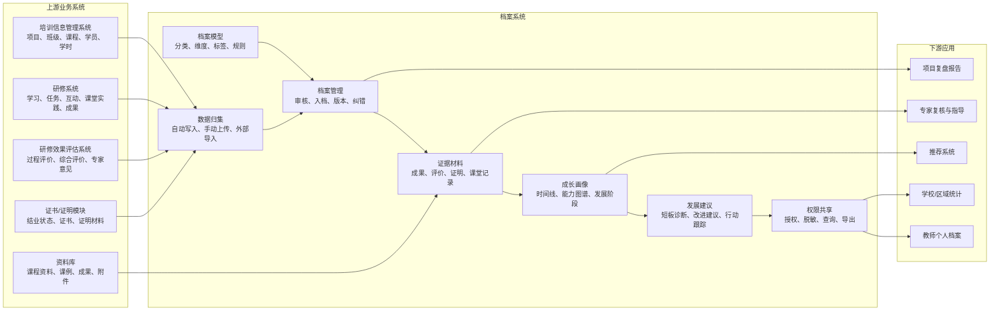
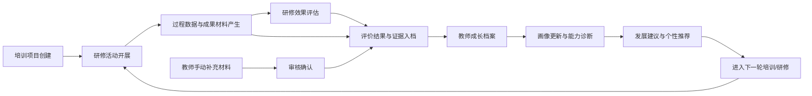

# 档案系统建设方案

## 一、建设背景

在教师培训、网络研修、线下工作坊、课堂实践和研修评估等业务过程中，教师会持续产生培训记录、学习过程、任务成果、课例材料、专家评价、证书学时和发展建议等数据。若这些数据只停留在单个项目、单次活动或单张报表中，培训结束后容易出现材料分散、成长轨迹断裂、评价结果难复用、后续推荐缺少依据等问题。

档案系统需要把培训平台中的过程数据、成果材料和评价结果长期沉淀下来，使一次次培训、研修和课堂实践能够转化为教师可追踪、可复盘、可展示、可授权共享的成长资产。

档案系统不只是“存材料”，而是把研修过程、评价结果、证书成果和发展建议沉淀为可追踪的个人成长档案。

## 二、建设定位

档案系统定位为培训平台中的“教师成长资产沉淀中心”，承接培训信息管理系统、研修系统、研修效果评估系统产生的数据和材料，并向推荐系统、教师画像、学校管理和区域分析提供持续更新的档案基础。

系统重点服务四类对象：

- 教师个人：查看个人培训记录、成果材料、评价结果、证书学时和成长轨迹。
- 培训管理者：掌握项目结业、成果沉淀、评价归档和材料完整情况。
- 学校/区域管理者：按权限查看教师发展情况、培训成果分布和能力提升趋势。
- 专家/导师：基于档案证据开展复核、指导、评价和发展建议确认。

## 三、建设目标

1. 建立统一档案模型  
   按教师、项目、能力维度、成果类型、评价节点和时间线组织档案内容，形成统一、可扩展的档案结构。

2. 实现自动归集与手动补充结合  
   自动归集培训项目、研修活动、任务提交、评价结果、证书学时等数据，同时支持教师和管理员补充外部材料。

3. 形成可追溯证据链  
   每条档案记录保留来源系统、归档时间、关联项目、审核状态和材料版本，支撑后续复核、申诉和展示。

4. 支撑教师画像与成长轨迹  
   基于培训经历、成果材料、评价结果和能力模型，持续更新教师个人画像、能力变化和发展阶段。

5. 支撑发展建议和推荐服务  
   将评价结论、能力短板、兴趣方向和成长目标转化为发展建议，并为课程、活动、资源和发展路径推荐提供依据。

6. 支撑权限共享和管理决策  
   支持教师个人查看、学校汇总、区域分析、专家复核和授权共享，兼顾个人数据保护和管理使用需求。

## 四、总体架构

档案系统以“档案模型”为规则基础，以“数据归集”为入口，以“档案管理”为质量控制，以“成长画像和发展建议”为价值输出，最终支撑教师个人成长、学校区域管理和后续培训推荐。

## 五、业务闭环

业务上形成两个闭环：

- 系统自动闭环：培训和研修产生数据，评估形成结论，结论和证据进入档案，档案更新画像，画像反哺推荐。
- 人工补充闭环：教师或管理员补充外部成果，专家或管理人员审核确认后入档，保证档案既完整又可信。

## 六、核心模块建设

### 6.1 档案模型模块

**建设定位**  
档案模型模块用于定义“档案记录什么、按什么结构记录、如何与项目和能力模型关联”。

**主要功能**

- 档案分类：支持基础信息、培训记录、学习过程、实践记录、成果材料、评价结果、证书学时、发展建议等分类。
- 维度映射：支持按能力模型、岗位序列、学段学科、培训主题、项目类型和成果类型进行归类。
- 字段配置：支持不同档案类型配置字段、附件要求、审核要求、可见范围和保留周期。
- 标签体系：支持项目标签、能力标签、成果标签、证据标签、优秀案例标签和风险提示标签。
- 模型版本：支持不同区域、学校、培训项目使用不同档案模板，并保留版本变更记录。

**建设成效**

- 档案从零散材料变成结构化成长资产。
- 不同项目、不同批次的档案数据具备统一口径。
- 后续评价、推荐和统计有稳定的数据基础。

### 6.2 数据归集模块

**建设定位**  
数据归集模块是档案系统的入口，负责从各业务系统自动写入档案记录，并支持必要的人工补充。

**主要功能**

- 自动写入：从培训信息管理系统写入项目、课程、班级、报名、学时和完成情况。
- 过程归集：从研修系统写入签到、学习、互动、任务、课堂实践、研讨和成果提交记录。
- 评价归集：从研修效果评估系统写入评分、等级、评语、专家意见、综合评价和改进建议。
- 证书归集：接入证书/证明模块，保存证书编号、签发时间、学时、结业状态和凭证文件。
- 手动补充：支持教师上传外部获奖、公开课、论文、课题、教研成果和其他证明材料。
- 外部导入：支持管理员批量导入历史培训记录、线下证明材料和区域历史档案数据。
- 去重校验：根据人员、项目、材料、时间、证书编号等信息进行重复检测和冲突提示。

**建设成效**

- 减少教师重复提交材料。
- 降低管理员人工汇总和整理成本。
- 保证档案内容既能自动沉淀，又能补足线下和外部成果。

### 6.3 档案管理模块

**建设定位**  
档案管理模块用于管理档案记录从产生、审核、入档、更新、纠错到失效的完整生命周期。

**主要功能**

- 入档流程：支持自动入档、待审核入档、退回补充、管理员确认等多种流程。
- 审核管理：支持按材料类型、项目、学校、区域和专家角色配置审核人。
- 状态管理：支持草稿、待审核、已入档、退回、已撤回、已失效等状态。
- 版本管理：对材料更新、评价复核、证书变更和人工纠错保留版本记录。
- 纠错申诉：支持教师对档案记录发起更正申请、补充说明和申诉。
- 审计留痕：记录查看、导出、审核、修改、授权和删除等关键操作。

**建设成效**

- 保证档案数据可信、可控、可追溯。
- 兼顾系统自动化效率和人工审核严肃性。
- 支撑后续评价复核、项目审计和管理检查。

### 6.4 证据材料模块

**建设定位**  
证据材料模块用于沉淀能够证明教师学习、实践、成果和能力变化的材料。

**主要功能**

- 成果材料：归档作业、课例、教学设计、案例、研究报告、课堂实录、教学反思等。
- 过程证据：归档签到、学习记录、互动记录、任务完成记录、研讨记录和专家点评。
- 评价证据：归档评分表、观察量表、专家评语、综合评价报告和复核意见。
- 证明材料：归档证书、学时证明、获奖证明、课题证明、发表证明和活动证明。
- 材料关联：支持材料与培训项目、研修任务、评价指标、能力维度和发展建议关联。
- 材料检索：支持按时间、项目、类型、能力点、标签、审核状态和来源检索。

**建设成效**

- 档案不只呈现结论，也保留支撑结论的证据。
- 教师成果可以长期保存、复盘和复用。
- 专家复核和学校管理有材料依据。

### 6.5 成长画像模块

**建设定位**  
成长画像模块用于把档案记录转化为可理解的教师发展状态。

**主要功能**

- 成长时间线：按时间展示培训经历、成果产出、评价变化、证书获得和发展建议。
- 项目视图：按培训项目展示学习完成、任务成果、评价结果和归档材料。
- 能力视图：按能力模型展示优势能力、待提升能力、证据覆盖和变化趋势。
- 成果视图：按课例、论文、课题、公开课、案例、反思等类型展示成果沉淀。
- 画像标签：根据任教学科、岗位角色、培训经历、能力表现和成果方向生成画像标签。
- 趋势分析：展示阶段性成长变化、连续参与情况和能力提升轨迹。

**建设成效**

- 教师可以清楚看到自己的成长过程。
- 管理者可以按能力和项目理解培训效果。
- 推荐系统可以基于画像生成更精准的发展服务。

### 6.6 发展建议模块

**建设定位**  
发展建议模块用于把评价结果和档案画像转化为可执行的后续改进方向。

**主要功能**

- 建议生成：根据评价结果、能力短板、证据缺口、发展目标生成发展建议。
- 专家确认：专家或管理员可对 AI 建议稿进行修改、确认和发布。
- 行动跟踪：支持将发展建议转化为后续课程、研修任务、课堂实践或成果补充要求。
- 完成反馈：记录教师是否采纳建议、是否进入推荐课程、是否完成后续任务。
- 建议归档：发展建议及其执行结果继续写入档案，形成连续成长记录。

**建设成效**

- 档案从“记录过去”延伸到“指导下一步”。
- 评估结论不止停留在报告中，而是进入教师发展行动。
- 推荐系统可以围绕真实短板提供课程、活动和资源。

### 6.7 权限共享模块

**建设定位**  
权限共享模块用于控制谁能看档案、看哪些内容、如何使用档案。

**主要功能**

- 角色权限：支持教师本人、学校管理员、区域管理员、培训机构、专家导师等角色。
- 范围控制：按组织、项目、班级、学校、区域、档案类型和材料敏感度控制可见范围。
- 授权共享：教师可授权向专家、学校、项目组或外部评审共享指定档案材料。
- 脱敏展示：面向区域统计、项目复盘和对外展示时支持脱敏处理。
- 导出控制：支持水印、有效期、下载权限、导出审批和导出记录。
- 访问审计：对档案查看、分享、下载、导出和授权操作进行留痕。

**建设成效**

- 满足教师个人数据保护要求。
- 支撑学校和区域管理的合理使用。
- 降低档案材料外泄、误用和越权查看风险。

### 6.8 查询统计与报告模块

**建设定位**  
查询统计与报告模块用于面向个人、项目、学校和区域输出档案分析结果。

**主要功能**

- 个人报告：输出教师培训经历、成果材料、评价结果、能力画像和发展建议。
- 项目报告：统计项目参与、任务完成、成果产出、评价入档和证书归档情况。
- 学校报告：分析学校教师培训覆盖、成果沉淀、能力分布和发展需求。
- 区域报告：分析区域培训参与、能力提升趋势、优秀成果分布和资源供给缺口。
- 自定义查询：支持按人员、学校、学科、项目、能力点、证书、时间等维度查询。
- 数据看板：展示档案数量、待审核材料、归档率、证据完整度、共享申请等运营指标。

**建设成效**

- 教师个人有成长报告。
- 项目管理有复盘依据。
- 学校和区域有培训决策数据。

### 6.9 AI 辅助模块

**建设定位**  
AI 辅助模块用于提升档案整理、材料理解、证据匹配和报告生成效率。

**主要功能**

- 材料摘要：对课例、作业、反思、研究报告等材料生成摘要。
- 自动分类：根据材料内容识别成果类型、能力维度、项目标签和证据类型。
- 缺项提示：识别档案材料缺失、证据不足、评价未归档和证书未同步等问题。
- 证据匹配：将材料与评价指标、能力项、发展建议进行关联推荐。
- 报告草稿：辅助生成个人成长报告、项目归档报告、学校统计报告和区域分析报告。
- 问答检索：支持围绕个人档案、项目档案和材料库进行智能问答。

**边界原则**

AI 只负责辅助整理、识别、摘要、提示和草拟，不自动替代专家评价、管理员审核和正式认定。涉及评分、等级、证书认定、优秀成果认定和负向结论的内容，应由人工确认后入档。

## 七、档案数据范围

| 数据类型 | 主要内容 | 主要来源 | 主要用途 |
| --- | --- | --- | --- |
| 基础信息 | 姓名、学校、学段、学科、岗位、角色、所属组织 | 组织与用户体系 | 档案主体识别、权限控制、统计分组 |
| 培训记录 | 项目、班级、课程、报名、出勤、学时、完成状态 | 培训信息管理系统 | 形成培训经历和结业依据 |
| 研修过程 | 学习、互动、任务、研讨、课堂实践、工作坊参与 | 研修系统 | 支撑过程留痕和评价证据 |
| 成果材料 | 作业、课例、教学设计、案例、研究报告、反思、课堂实录 | 研修系统、资料库、手动上传 | 支撑成果沉淀、专家复核和展示 |
| 评价结果 | 过程评价、综合评价、专家评语、等级、改进建议 | 研修效果评估系统 | 更新画像、生成报告和推荐依据 |
| 证书学时 | 证书编号、签发时间、学时、结业状态、证明文件 | 证书/证明模块 | 支撑学习成果认定和档案查询 |
| 发展建议 | 能力短板、成长目标、推荐路径、行动跟踪 | 评估系统、推荐系统、专家确认 | 支撑后续培训和持续改进 |
| 操作留痕 | 审核、修改、授权、查看、导出、共享记录 | 档案系统 | 支撑安全审计和责任追溯 |

## 八、与其他系统的关系

### 8.1 与培训信息管理系统

培训信息管理系统提供项目、班级、课程、学员、报名、费用、学时和结业等基础数据。档案系统接收这些数据后，形成教师培训经历和项目参与记录。

### 8.2 与研修系统

研修系统提供线上学习、线下实训、任务实践、协同研讨、课堂教学实践、成果共创和过程留痕数据。档案系统将其中具有归档价值的记录和材料沉淀为过程证据和成果档案。

### 8.3 与研修效果评估系统

研修效果评估系统输出评价模型计算结果、专家评语、等级认定、综合报告和改进建议。档案系统负责保存评价结论及证据来源，并将其转化为成长画像和发展建议。

### 8.4 与资料库

资料库负责保存课程资料、成果材料、评价附件和知识资产。档案系统可引用资料库中的文件、标签和解析结果，避免重复存储，同时保证档案记录可追溯到原始材料。

### 8.5 与推荐系统

推荐系统读取档案中的教师画像、培训历史、评价结果、能力短板和发展目标，生成课程、活动、资源、专家和发展路径推荐。推荐结果及采纳情况可回写档案，形成“推荐—行动—归档”的闭环。

### 8.6 与 AI 原生产品底座

档案系统复用 AI 原生产品底座中的空间、资料库、智能体、权限、流程、消息和大数据能力。底座提供共性能力，档案系统承载教师成长档案业务，二者共同支撑后续培训、评价和推荐服务。

## 九、权限与安全设计

1. 数据归属清晰  
   教师个人档案以教师为主体，学校、区域和培训机构按业务权限查看相关范围数据。

2. 最小权限访问  
   不同角色只访问完成职责所需的数据，敏感材料默认不对外共享。

3. 授权共享可控  
   对外共享档案时应明确共享对象、共享范围、有效期、下载权限和水印策略。

4. 关键操作留痕  
   对材料审核、档案修改、结果确认、导出下载、授权共享和删除操作进行审计。

5. 数据脱敏统计  
   学校、区域和项目报告中涉及个人隐私的数据，应按场景进行脱敏、汇总或匿名化展示。

6. 档案保留与归档  
   按数据类型配置保留周期和失效规则，重要评价结论、证书记录和成果证明应长期保留。

## 十、建设路径

### 第一阶段：档案基础能力建设

建设档案模型、档案分类、教师个人档案首页、培训记录归档、材料上传、基础审核和查询能力。

**阶段成果**

- 建立统一档案模板。
- 支持教师查看个人档案。
- 支持培训记录和成果材料基础归档。
- 支持管理员审核和维护档案记录。

### 第二阶段：研修与评估联动

打通研修系统和研修效果评估系统，自动写入学习过程、任务成果、评价结果、专家意见、证书学时和项目报告。

**阶段成果**

- 研修过程数据可自动进入档案。
- 评价结果和证据材料可追溯。
- 项目结业后自动形成档案归集结果。
- 支持项目、班级和学校维度统计。

### 第三阶段：画像与发展建议

建设成长时间线、能力视图、成果视图、画像标签、能力诊断和发展建议模块，并与推荐系统形成联动。

**阶段成果**

- 教师成长轨迹可视化。
- 能力短板和证据缺口可识别。
- 发展建议可确认、跟踪和归档。
- 推荐系统可基于档案输出个性化服务。

### 第四阶段：智能化与区域化应用

引入 AI 辅助分类、摘要、证据匹配、缺项提示和报告草稿生成，拓展学校、区域和项目治理场景。

**阶段成果**

- 档案整理效率提升。
- 区域培训质量分析更充分。
- 优秀成果和典型案例可沉淀复用。
- 形成“培训、研修、评估、档案、推荐”的持续闭环。

## 十一、运营指标

| 指标类型 | 指标示例 | 说明 |
| --- | --- | --- |
| 档案覆盖 | 建档人数、建档率、活跃档案数 | 衡量档案系统覆盖范围 |
| 归档质量 | 自动归档率、材料完整率、证据覆盖率 | 衡量档案内容完整程度 |
| 审核效率 | 待审核数量、平均审核时长、退回率 | 衡量档案审核运营效率 |
| 成果沉淀 | 成果材料数量、优秀成果数量、复用次数 | 衡量培训成果资产化情况 |
| 评价联动 | 评价结果入档率、专家意见入档率、报告生成率 | 衡量评估与档案闭环情况 |
| 推荐联动 | 推荐生成数、推荐采纳率、建议完成率 | 衡量档案对后续发展服务的支撑 |
| 安全合规 | 授权共享次数、导出次数、越权拦截数 | 衡量权限和数据安全运行情况 |

## 十二、预期成效

- 对教师个人：形成连续、可信、可展示的个人成长档案，减少重复提交材料，帮助教师复盘成长和明确下一步发展方向。
- 对培训管理者：实现培训过程、成果、评价和证书统一归档，提高项目复盘、结业管理和质量评估效率。
- 对学校/区域：掌握教师培训覆盖、能力变化、成果分布和发展需求，为校本研修、区域教研和培训规划提供依据。
- 对平台产品：打通培训信息、研修活动、评估分析、教师档案和推荐服务，形成可持续运营的数据闭环。

## 十三、总结

档案系统是培训平台从“项目交付”走向“长期发展服务”的关键承接层。它把教师在培训、研修、课堂实践和评价中的关键记录沉淀为成长资产，再通过画像、建议和推荐进入下一轮学习与改进。建成后，平台将形成“活动有过程、评价有证据、成果有沉淀、发展有路径”的一体化能力。
