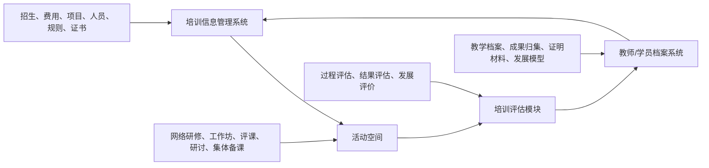
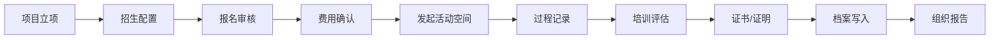

# 果仁培训信息管理系统产品规划

## 1. 产品定位

果仁培训信息管理系统是面向培训机构、组训机构、参训机构以及学员的 **AI 原生培训业务信息中枢**。

它不重新定义培训、研修、评课、评估等业务本身，而是用 AI 原生平台能力重新组织培训业务模式：将机构、项目、招生、费用、人员、资源、规则、学分、证书、档案和评估结果统一纳入可配置、可追踪、可分析、可复用的信息体系。

在整体培训产品蓝图中，培训信息管理系统与活动空间、培训评估模块的边界如下：

- **培训信息管理系统**：负责培训业务信息、关系、规则、台账和档案管理。
- **活动空间**：负责承载网络研修、线下工作坊实训、评课、研讨、集体备课等活动过程。
- **培训评估模块**：负责汇总过程证据与结果证据，形成发展评价、证明材料和组织报告。
- **教师档案系统/模块**：承接培训成果、教学档案、发展模型、档案归集和发展评估。

一句话概括：**信息管理定义业务对象，活动空间承载过程，培训评估沉淀结果，教师档案形成长期发展资产。**

## 2. 服务对象

### 2.1 培训机构

培训机构是培训产品、课程资源、讲师专家、培训服务和证书证明的主要供给方。

主要诉求：

- 管理培训项目、课程、讲师、专家、资源和服务套餐。
- 发布招生信息、报名规则、收费标准和培训计划。
- 维护培训费用、经费、学分、证书和结业规则。
- 查看招生情况、参训情况、完成情况和项目效果。
- 形成培训机构视角的运营台账和服务报告。

### 2.2 组训机构

组训机构是培训组织和统筹方，通常负责需求收集、项目立项、人员组织、名额分配、过程监管和结果接收。

主要诉求：

- 发起培训需求，组织培训计划和项目批次。
- 管理下属参训机构、参训对象、名额和报名审核。
- 跟踪报名、缴费、参训、完成、证书和评估状态。
- 协调培训机构、参训机构、学员和专家之间的信息流。
- 汇总组织维度的培训结果、学分、证书和发展报告。

### 2.3 参训机构

参训机构是派员参加培训的单位，例如学校、企业部门、合作单位或区域组织。

主要诉求：

- 接收培训通知、报名要求、名额分配和审核规则。
- 组织本单位人员报名、资料提交、资格确认和费用确认。
- 查看本单位人员参训进度、完成状态、证书和评估结果。
- 汇总本单位培训台账、教师/员工成长档案和发展建议。
- 接收组织报告，并用于内部人才发展、教师发展或业务改进。

### 2.4 学员

学员是培训和发展活动的直接参与者。

主要诉求：

- 查看可报名项目、培训要求、日程安排和资料清单。
- 完成报名、资格材料提交、缴费或单位确认。
- 查看活动空间入口、学习任务、研修记录和通知提醒。
- 查询学分、证书、证明、评估结果和个人发展档案。
- 获得 AI 辅助答疑、材料提醒、成果整理和发展建议。

## 3. 核心业务架构

培训信息管理系统围绕“信息建模 -> 活动发起 -> 过程回流 -> 评估归档”的业务闭环建设。

系统边界：

- 培训信息管理系统不承载活动现场，不替代活动空间。
- 活动空间不管理完整培训信息关系，只接收活动所需的人员、资源、规则和智能体配置。
- 培训评估模块不重复建设报名和费用台账，而是消费信息台账与空间证据。
- 教师/学员档案系统沉淀长期发展资产，服务复训建议、能力发展和组织学习。

## 4. 核心模块规划

### 4.1 机构与账号管理

管理培训业务中的多主体身份和组织关系。

核心能力：

- 培训机构、组训机构、参训机构、外部合作机构管理。
- 学员、讲师、专家、管理员、运营人员等角色管理。
- 组织层级、来源组织、机构标签、身份标签和联系人管理。
- 多租户隔离、跨机构授权、临时账号和账号有效期。
- 不同主体的数据访问边界和操作权限配置。

### 4.2 培训项目管理

管理培训项目的基础信息、业务规则和运行周期。

核心能力：

- 项目名称、项目类型、培训主题、培训对象和项目目标。
- 项目批次、周期、负责人、主办方、承办方和协办方。
- 培训类别：课程培训、网络研修、线下实训、工作坊、评课、研讨、认证培训等。
- 培训要求：学时、学分、证书、成果提交、评价规则。
- 项目状态：筹备中、招生中、进行中、已结束、已归档。

### 4.3 招生与报名管理

管理培训项目从发布到报名审核的完整链路。

核心能力：

- 招生计划、招生简章、报名说明和报名时间管理。
- 公开报名、定向邀请、单位推荐、批量导入。
- 报名表单、资格条件、材料清单和审核流程。
- 名额控制、候补机制、分组规则和报名状态跟踪。
- 报名通知、审核提醒、材料补交通知和结果反馈。

### 4.4 费用与经费管理

管理培训费用、经费预算、缴费确认和费用台账。

核心能力：

- 收费标准、费用项、优惠减免、单位结算。
- 学员缴费、机构代付、经费来源和预算控制。
- 缴费状态、退款状态、费用确认和对账记录。
- 发票/收据、结算单、费用报表和导出。
- 按项目、机构、学员、批次统计费用情况。

### 4.5 人员与组织关系管理

管理参训对象及其所在组织、角色和参与关系。

核心能力：

- 学员档案、单位归属、岗位/学科/职级等基础信息。
- 讲师、专家、导师、评委、班主任、运营人员管理。
- 参训机构、来源组织、群组、班级、批次和分组关系。
- 参与身份：学员、主持人、讲师、专家、观察员、运营人员等。
- 支持组织维度、项目维度、个人维度的人员台账。

### 4.6 资源与规则管理

管理培训资源、活动规则、成果要求和资料授权。

核心能力：

- 课程、课件、案例、资料包、评课表、问卷、任务模板。
- 学分规则、证书规则、结业规则、成果提交规则。
- 准入条件、名额规则、资料访问范围和权限有效期。
- 资源标签、适用对象、适用项目和复用记录。
- 与活动空间衔接，将活动所需资源和规则同步到空间。

### 4.7 教师/学员档案袋

沉淀个人长期发展记录，教育场景可扩展为教师档案袋和教学档案。

核心能力：

- 个人基本信息、参训记录、学分记录和证书证明。
- 教师成长档案、教学档案、课堂反思、公开课记录。
- 研修成果、评课记录、课堂行为分析、专家点评。
- 发展模型、档案归集、发展评估和复训建议。
- 支持个人查看、单位查看、组织汇总和授权导出。

### 4.8 数据与报表中心

面向不同主体形成差异化统计、台账和报告。

核心能力：

- 培训机构视角：招生、收入、完成率、满意度、证书发放、项目效果。
- 组训机构视角：组织参训、名额使用、学分达成、单位完成率、发展报告。
- 参训机构视角：本单位报名、参训、完成、证书、档案和发展建议。
- 学员视角：个人报名、参训记录、任务成果、证书、评价和档案。
- 支持 AI 自动生成项目总结、组织报告和个人发展建议。

## 5. 培训评估模块规划

培训评估模块连接信息台账与活动空间证据，形成过程评估、结果评估和发展评估。

### 5.1 评估规则

定义评价指标体系和规则。

核心能力：

- 指标体系、评价表、评分规则、权重和达标线。
- 面向不同项目类型配置不同评估模型。
- 支持课程培训、网络研修、工作坊、评课、研讨、认证培训等场景。
- 支持人工评价、专家评价、同伴互评、问卷评价和 AI 辅助分析。

### 5.2 过程评估

基于活动空间中的过程数据形成过程性评价。

核心能力：

- 签到、在线时长、互动发言、任务提交、问卷反馈。
- 课堂行为分析、研讨行为分析、评课意见分析。
- 低活跃预警、任务逾期预警、材料缺失预警。
- 对网络研修、线下工作坊实训、集体备课、课例研讨等活动形成过程记录。

### 5.3 结果评估

基于成果、考试、评价和满意度形成结果性评价。

核心能力：

- 成果质量、作业质量、案例产出、课堂改进成果。
- 考试/测评成绩、专家评审、满意度、能力达成。
- 学分认定、证书发放、结业结果和证明材料。
- 个人、项目、机构、组织维度的结果报告。

### 5.4 档案写入

将评估结论写入教师/学员档案系统。

核心能力：

- 写入发展模型、档案归集、发展评估。
- 沉淀教学档案、研修成果、证明材料和专家建议。
- 形成个人发展画像、复训建议和组织人才发展报告。
- 支持跨项目、跨年度、跨机构的成长轨迹分析。

## 6. AI 原生能力

培训信息管理系统的 AI 能力不只是“生成文案”，而是围绕业务信息、活动过程和评估结果形成智能协同。

### 6.1 信息建模助手

- 自动生成项目结构、报名表单、招生简章和通知文案。
- 辅助配置学分、证书、费用、名额和准入规则。
- 识别报名条件冲突、重复报名、材料缺失和名额风险。

### 6.2 运营问答助手

- 面向学员回答报名条件、日程安排、费用缴纳、资料提交等问题。
- 面向参训机构回答名额、审核、人员状态、证书发放等问题。
- 面向培训机构和组训机构回答项目进度、报名情况和费用台账问题。

### 6.3 过程分析助手

- 从活动空间中整理研讨纪要、评课意见、课堂反馈和问卷结果。
- 识别低参与、低完成、低满意度和材料缺失风险。
- 为运营人员生成提醒、改进建议和复盘材料。

### 6.4 评估报告助手

- 汇总信息台账、空间证据、成果材料和满意度数据。
- 生成个人证明、项目报告、组织报告和发展建议。
- 辅助将评估结果写入教师档案袋或个人发展档案。

## 7. 典型业务流程

流程说明：

1. 培训机构或组训机构建立培训项目。
2. 信息管理系统配置招生、报名、费用、人员、资源和规则。
3. 学员或参训机构完成报名、审核和费用确认。
4. 需要过程运营时，将活动、人员、资源和规则同步到活动空间。
5. 活动空间承载网络研修、线下工作坊、评课、研讨等过程。
6. 培训评估模块汇总过程证据和结果证据。
7. 系统生成证书、证明、项目报告和组织报告。
8. 结果写入教师档案袋或个人发展档案。

## 8. 分阶段建设建议

### V1：信息管理闭环

优先建设项目、机构、人员、招生、报名、费用、学分、证书和台账能力。

目标：先把培训业务对象和信息关系管起来。

### V2：活动空间衔接

将培训信息管理系统与活动空间打通，支持网络研修、线下实训、评课、研讨等活动发起。

目标：实现“信息建模 -> 活动发起 -> 过程记录”的闭环。

### V3：培训评估模块

建设评估规则、过程评估、结果评估、档案写入能力。

目标：把过程证据和结果证据转化为发展评价和组织报告。

### V4：教师/学员档案袋

沉淀教师成长档案、教学档案、个人发展档案、证书证明和发展建议。

目标：让培训结果成为长期发展资产。

### V5：AI 原生增强

引入信息建模助手、报名问答助手、过程分析助手、评估报告助手和档案归集助手。

目标：让培训信息管理从人工台账升级为 AI 原生业务运营。

## 9. 产品价值

对培训机构：

- 提升招生、费用、项目和证书管理效率。
- 沉淀可复用课程、资源、规则和服务包。
- 获得项目运营、收入、完成率和效果报告。

对组训机构：

- 统一管理培训需求、参训组织、名额、过程和结果。
- 提升组织维度的培训监管和效果追踪能力。
- 形成可沉淀、可复盘、可改进的培训治理体系。

对参训机构：

- 便捷完成报名组织、人员审核、费用确认和结果接收。
- 查看本单位人员参训进度、证书和发展建议。
- 沉淀单位培训台账和人才/教师发展档案。

对学员：

- 获得清晰的报名、参训、任务、证书和档案查询体验。
- 形成个人学习与发展记录。
- 获得 AI 辅助提醒、总结和发展建议。

## 10. 总结

培训信息管理系统的核心不是单点报名，也不是简单台账，而是面向多主体协同的 AI 原生培训业务信息中枢。

它通过独立的信息管理系统承接招生、费用、项目、人员、资源、规则和档案；通过活动空间承载研修过程；通过培训评估模块沉淀过程评价、结果评价和发展评价；最终将培训业务从一次性项目交付升级为可运营、可评估、可沉淀、可复用的 AI 原生业务模式。
