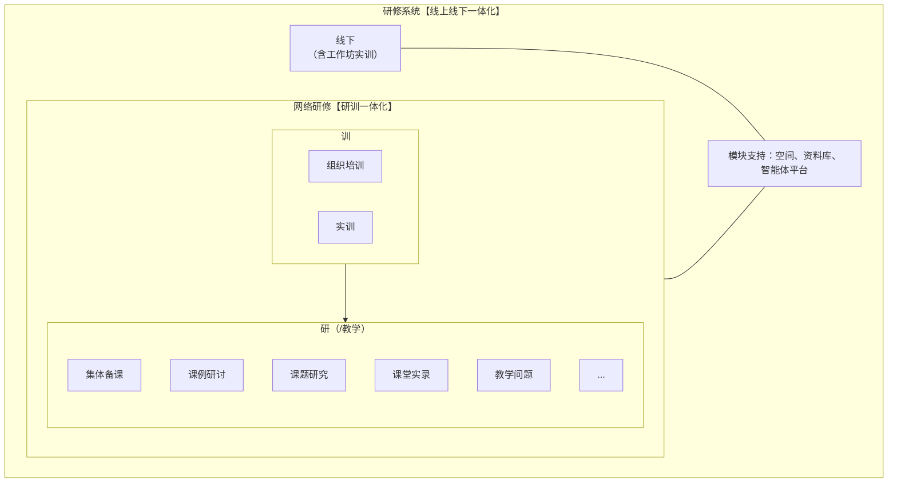
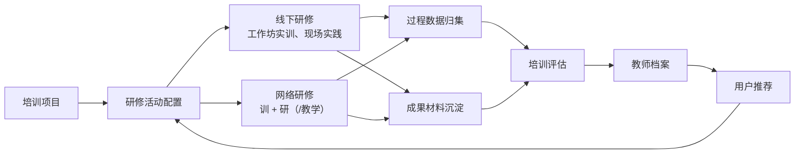
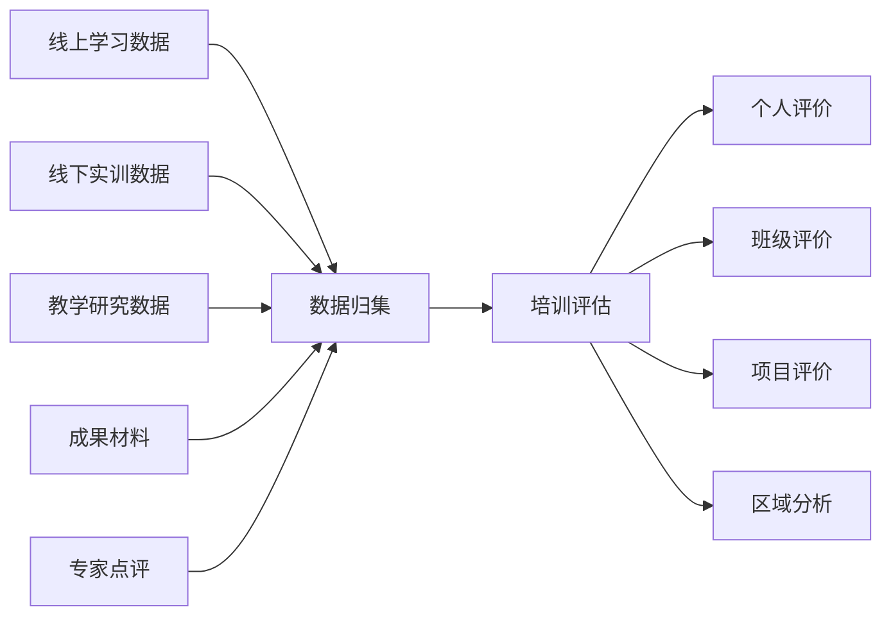
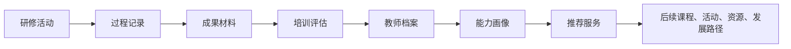

# 研修系统（线上线下一体化）产品建设方案

## 一、建设背景

培训平台中的研修系统，不能只被理解为线上学习系统，也不能只停留在线下活动管理。面向教师培训、校本研修、区域教研、工作坊实训和教学能力提升等场景，研修系统需要同时承载线上学习、线下实训、教学研究、任务实践、成果沉淀和评价联动，形成“线上线下一体化”的研训闭环。

从业务形态看，研修系统由两类核心场景构成：

- 线下：包括集中培训、线下工作坊、现场实训、跟岗实践、观摩研讨、成果打磨等。
- 网络研修：体现“研训一体化”，既包含组织培训、实训等“训”的活动，也包含集体备课、课例研讨、课题研究、课堂实录、教学问题解决等“研（/教学）”活动。

系统底层由空间、资料库、智能体平台提供支撑，将活动、任务、成员、资源、过程、成果和评价统一承载，避免线上线下割裂、研训割裂和成果沉淀割裂。

## 二、建设定位

研修系统定位为培训平台中的“研训活动承载系统”，负责把培训项目中的学习、实践、研究和成果过程组织起来。

它不是单一的课程学习系统，也不是单一的线下活动系统，而是围绕教师成长和教学改进，形成“培训组织 + 线上研修 + 线下实训 + 教学研究 + 成果沉淀 + 评价反馈”的综合系统。

## 三、建设目标

1. 支撑线上线下一体化研修  
   将线上学习、网络研修、线下工作坊、现场实训、专家辅导和成果展示纳入同一研修体系。

2. 支撑研训一体化  
   在网络研修中同时承载“训”和“研（/教学）”，既能组织培训任务，也能开展教学研究和问题解决。

3. 支撑工作坊实训  
   将线下工作坊作为重要实训载体，支持分组协作、任务实践、专家指导、成果共创和过程留痕。

4. 支撑全过程数据沉淀  
   归集签到、学习、互动、任务、研讨、成果、点评、评价等数据，为培训评估和教师档案提供依据。

5. 支撑成果复用和持续改进  
   将课例、案例、方案、课题成果、课堂实录和教学问题解决方案沉淀为资料库资产，反哺后续培训和推荐。

6. 支撑 AI 原生能力赋能  
   通过智能体平台辅助活动方案生成、任务设计、资料问答、成果摘要、问题诊断、研讨纪要和评价建议。

## 四、总体架构

总体上，研修系统由“线下”和“网络研修”两大场景组成。线下侧重点是工作坊实训和现场实践，网络研修侧重点是把培训任务和教学研究贯通起来。空间负责承载场景，资料库负责沉淀资源和成果，智能体平台负责提供 AI 辅助能力。

## 五、业务闭环

研修系统的关键价值在于形成闭环：培训项目发起研修活动，线上线下共同承载学习、实践和研究过程，过程数据和成果材料进入评估体系，评价结果沉淀到教师档案，并进一步反哺后续课程、活动、资源和发展路径推荐。

## 六、核心场景建设

### 6.1 线下研修（含工作坊实训）

**建设定位**  
线下研修用于承载集中培训、工作坊实训、现场观摩、跟岗实践、成果打磨和专家指导等面对面场景。

**主要功能**

- 线下活动管理：支持活动主题、时间、地点、人员、日程、负责人和所属项目配置。
- 工作坊管理：支持创建工作坊、小组分配、导师绑定、任务编排和过程记录。
- 现场签到：支持二维码签到、定位签到、管理员补签、请假和出勤统计。
- 现场互动：支持提问、讨论、展示、投票、问卷、专家点评和活动纪要。
- 实训任务：支持任务书、案例分析、教学设计、课例打磨、课堂改进方案等任务类型。
- 成果提交：支持个人成果、小组成果、阶段成果和最终成果提交。
- 专家辅导：支持过程指导、成果点评、等级评价、优秀推荐和复核确认。

**建设成效**  
让线下活动从临时组织转为平台化运行，使工作坊实训具备任务牵引、过程留痕、成果沉淀和评价联动能力。

### 6.2 网络研修【研训一体化】

**建设定位**  
网络研修用于承载线上学习、培训任务、教学研究、课例共研和持续协同，是线上线下一体化中的线上核心场景。

**主要功能**

- 线上学习：支持课程学习、资料学习、学习提醒、学习进度和学习记录。
- 任务实践：支持线上任务发布、作业提交、阶段反馈和任务完成统计。
- 协同研讨：支持主题讨论、小组研讨、问题答疑、成果共创和专家参与。
- 成果共创：支持课例、方案、案例、课题材料和教学反思的协同沉淀。
- 过程留痕：支持学习、互动、任务、研讨、提交、点评等过程数据沉淀。

**建设成效**  
让网络研修不只是“看课和交作业”，而是成为培训、教学研究、协同实践和成果沉淀的一体化空间。

### 6.3 “训”场景

**建设定位**  
“训”侧重培训组织和能力训练，面向项目管理、课程学习、任务实践和实训活动。

**主要功能**

- 组织培训：支持培训班级、课程安排、学习任务、通知提醒、进度跟踪和完成统计。
- 实训活动：支持线上实训、线下实训和混合式实训，围绕具体能力点配置任务和成果要求。
- 培训任务：支持任务发布、任务说明、提交要求、评分规则和阶段反馈。
- 学习支持：支持资料包、案例包、工具模板、FAQ 和智能问答。

**建设成效**  
将培训活动从“课程交付”升级为“任务驱动的能力训练”，提升培训组织效率和实践转化效果。

### 6.4 “研（/教学）”场景

**建设定位**  
“研（/教学）”侧重教学研究和问题解决，围绕真实课堂、真实课例和真实教学问题开展协同研修。

**主要功能**

- 集体备课：支持备课主题、教材内容、教学目标、教学设计、分工协作和版本沉淀。
- 课例研讨：支持课例上传、课例观摩、评课议课、专家点评和改进建议。
- 课题研究：支持课题立项、过程材料、阶段成果、研究日志和结题成果沉淀。
- 课堂实录：支持课堂视频、听评课记录、观察量表、课堂行为分析和改进反馈。
- 教学问题：支持问题征集、问题分类、原因分析、解决方案共创和案例沉淀。
- 其他扩展：支持根据区域、学校、学科和项目需要扩展专题研修活动。

**建设成效**  
把教师培训与真实教学改进连接起来，使研修活动能够围绕课堂问题、教学实践和成果改进持续发生。

## 七、支撑模块建设

### 7.1 空间

**建设定位**  
空间是研修活动的承载容器，用于承载项目、班级、工作坊、小组、课题组和专题研修场景。

**主要功能**

- 场景空间：支持培训班、工作坊、教研组、课题组、集体备课组等空间类型。
- 成员管理：支持学员、教师、导师、专家、管理员等角色进入同一空间协作。
- 任务协同：支持任务发布、分工、提交、反馈、提醒和进度跟踪。
- 过程沉淀：支持活动记录、讨论记录、材料记录、成果记录和评价记录。

**建设成效**  
通过空间把人、任务、资源、工具和成果组织到同一场景中，解决研修过程分散的问题。

### 7.2 资料库

**建设定位**  
资料库用于沉淀研修过程中的课程、案例、制度、模板、成果、评价材料和优秀实践。

**主要功能**

- 资源沉淀：沉淀课程、案例、课例、任务单、工具模板、培训材料和专家资料。
- 成果沉淀：沉淀教学设计、课堂实录、研究报告、课题成果、优秀作业和案例方案。
- 标签管理：按项目、学段、学科、主题、能力点、活动类型和成果类型进行标签化。
- 检索复用：支持资料检索、资源推荐、成果复用和后续项目引用。

**建设成效**  
将研修过程中产生的材料转化为可管理、可检索、可复用的知识资产。

### 7.3 智能体平台

**建设定位**  
智能体平台为研修系统提供 AI 辅助能力，服务培训组织者、导师、专家、教师和管理人员。

**主要功能**

- 方案辅助：辅助生成研修方案、工作坊方案、任务设计和日程安排。
- 学习助手：围绕课程、资料和任务提供问答、导学、提醒和知识点解释。
- 教研助手：辅助集体备课、课例分析、教学问题诊断和改进建议生成。
- 运营助手：辅助通知生成、进度汇总、活动纪要、问题答复和报告草稿。
- 评价辅助：辅助进行证据整理、成果摘要、缺项提示和评价建议生成。

**边界原则**  
AI 只做辅助生成、整理、分析和提示，不自动替代专家判断和管理确认。涉及评分、等级、评价结论和正式认定的内容，应由专家或管理人员复核确认。

## 八、数据归集与评估联动

研修系统需要为培训评估系统提供完整、可追溯的过程证据和成果证据。

**数据归集范围**

- 基础数据：项目、班级、活动、空间、成员、角色、任务、周期。
- 学习数据：课程学习、资料学习、学习进度、学习时长、完成情况。
- 线下数据：签到、出勤、分组、现场互动、实训任务、专家辅导。
- 研讨数据：讨论、提问、回复、评课、共创、教学问题、课题过程。
- 成果数据：作业、案例、教学设计、课例、课堂实录、课题成果、研究报告。
- 评价数据：任务评价、专家点评、过程评价、成果评价、满意度和能力达成。

通过统一数据归集，研修系统能够支撑个人、班级、项目和区域层面的培训评估，并为后续教师档案沉淀和推荐服务提供数据基础。

## 九、与教师档案和用户推荐的关系

研修系统中的学习过程、线下实训、教学研究、成果材料和评价结果，最终应沉淀到教师档案中，并进一步支撑个性化推荐。

教师档案不只是记录培训经历，还应沉淀教师在工作坊实训、课例研讨、课题研究、课堂改进和成果共创中的成长证据。推荐服务则基于教师画像和评价结果，推荐后续课程、活动、资源和发展路径。

## 十、建设成效

1. 研修活动统一承载  
   将线上学习、线下实训、网络研修、教学研究和工作坊活动放入统一系统中管理。

2. 研训一体更加清晰  
   网络研修不再只是线上课程，而是同时支持“训”和“研（/教学）”的综合场景。

3. 线下过程可记录  
   工作坊实训、现场互动、专家辅导和成果提交形成完整过程留痕。

4. 教学研究可沉淀  
   集体备课、课例研讨、课题研究、课堂实录和教学问题解决形成可复用成果。

5. 评价证据更完整  
   线上、线下、教学研究和成果数据统一进入评估体系，使评价更有依据。

6. 后续发展更精准  
   评价结果沉淀到教师档案，并反哺个性化推荐和后续培训设计。

## 十一、建设建议

首期建议优先建设“研修活动配置、线下工作坊、网络研修、任务实践、成果提交、资料库沉淀、数据归集、评估联动”八类能力，先形成线上线下一体化研修闭环。

后续可逐步扩展 AI 教研助手、课堂实录分析、课题研究过程管理、优秀成果自动入库、跨项目成果复用、区域研修质量分析和教师发展路径推荐等能力。
