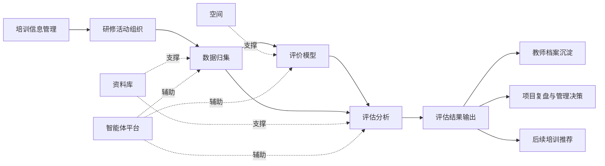
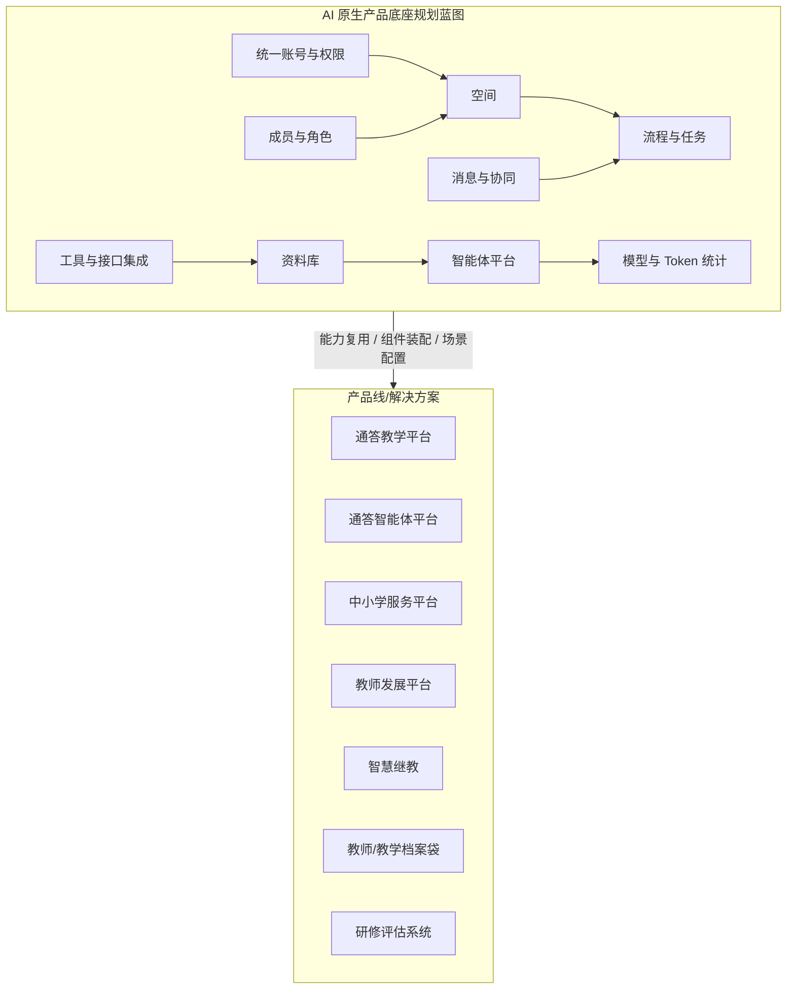
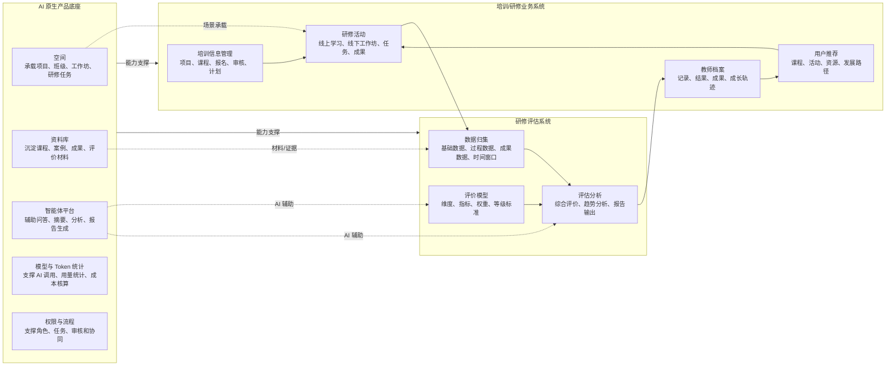
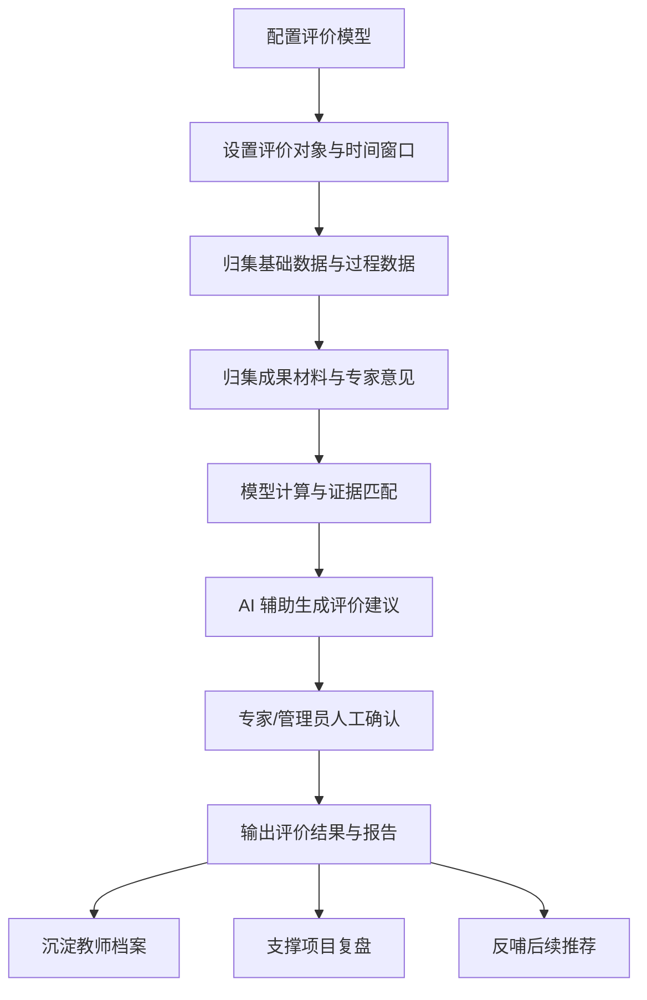

# 研修评估系统产品建设方案

## 一、建设背景

在教师培训、校本研修、工作坊实训、网络研修等业务场景中，培训过程数据、学习成果材料、专家评价意见和项目管理数据往往分散在不同环节。传统评估方式容易停留在结果统计层面，难以持续回答三个核心问题：

- 培训过程是否真实发生，参与度、完成度和互动质量如何。
- 研修成果是否有效沉淀，能否支撑专家评价和质量改进。
- 评价结果能否回流到教师档案、项目复盘和后续推荐服务。

研修评估系统面向培训平台中的评价场景建设，围绕“评价模型、数据归集、评估分析”三项核心能力，形成从指标设定、过程留痕、数据归集、综合评估到结果输出的产品闭环。

## 二、产品定位

研修评估系统是培训平台中的过程评价与结果评价产品能力，重点服务培训项目负责人、专家评审人员、学校/区域管理者和教师个人。

系统不只是一个报表工具，而是面向研修业务的评价中台能力：

- 对上承接培训信息、研修活动、工作坊实训、网络研修等业务数据。
- 对中形成评价模型、时间窗口、过程证据、成果材料和评估报告。
- 对下输出教师档案、项目质量分析、区域培训画像和后续推荐依据。

## 三、建设目标

1. 建立统一评价模型  
   支持按项目、班级、个人、区域等对象配置评价维度、指标、权重、等级标准和评价规则。

2. 归集全过程评价数据  
   覆盖签到、学习、互动、任务、问卷、课堂行为、研讨行为、成果材料、专家意见等过程与结果数据。

3. 形成可解释评估结果  
   支持个人评价、班级评价、项目评价、区域评价、趋势分析和报告输出，让评价结论有依据、可追溯。

4. 支撑专家复核与人工确认  
   AI 可辅助证据整理、指标匹配和建议稿生成，但最终评价结论应由专家或管理人员确认。

5. 支撑档案沉淀和持续改进  
   将评价结果、证据材料、成长轨迹沉淀到教师档案，并反哺后续培训设计、资源推荐和项目优化。

## 四、总体架构

系统以评价模型为规则基础，以数据归集为证据基础，以评估分析为结果输出能力。空间、资料库和智能体平台作为底层支撑模块，分别提供场景承载、材料沉淀和智能辅助能力。

### 4.1 AI 原生产品底座规划蓝图

研修评估系统不是孤立建设的单点应用，而应纳入“AI 原生产品底座”的统一规划中。底座负责沉淀共性能力，业务系统负责承载具体场景，两者通过模块化、可配置和可组装的方式形成产品矩阵。

AI 原生产品底座的规划重点包括：

- 统一底座能力：沉淀空间、资料库、智能体、模型与 Token 统计、权限、流程、成员、消息、工具集成等基础能力。
- 统一开发模式：通过原子组件、场景模板和 AI 原生开发模式，支撑业务产品快速组合、试错和迭代。
- 统一智能入口：通过智能体平台为不同角色提供问答、生成、分析、任务辅助和流程推进能力。
- 统一资料沉淀：将课程、案例、成果、评价材料、项目资料沉淀为可检索、可问答、可生成的知识资产。
- 统一产品矩阵：面向通答教学平台、智能体平台、中小学服务平台、教师发展平台、智慧继教、教师/教学档案袋等产品线复用底座能力。

### 4.2 AI 原生产品底座 + 研修评估系统蓝图

在研修评估系统中，AI 原生产品底座不直接替代业务系统，而是为评价模型、数据归集和评估分析提供共性能力支撑。业务上形成“研修活动产生数据、数据归集形成证据、评价模型计算结果、评估分析输出报告、结果沉淀到档案并反哺推荐”的闭环。

从规划关系上看，研修评估系统是“AI 原生产品底座 + 培训/研修业务”的典型组合形态：

- 底座提供可复用能力：空间、资料库、智能体、权限流程、模型统计等。
- 业务系统提供真实场景：培训信息、研修活动、教师档案和用户推荐。
- 评估系统提供评价闭环：评价模型、数据归集、评估分析和结果沉淀。
- AI 提供辅助能力：证据整理、指标匹配、缺项提示、评价建议和报告草稿。
- 人工负责最终确认：专家和管理人员对评分、等级、评语和最终结论进行复核。

## 五、核心模块建设

### 5.1 评价模型模块

**建设定位**  
评价模型模块是研修评估系统的规则中心，用于定义“评什么、怎么评、谁来评、按什么标准评”。

**主要功能**

- 评价对象配置：支持个人、班级、项目、学校、区域等评价对象。
- 评价维度配置：支持参与度、完成度、学习表现、任务质量、成果质量、专家评价等维度。
- 指标体系配置：支持指标名称、指标说明、评分标准、权重、等级标准和适用范围配置。
- 评价主体配置：支持系统计算、学员自评、同伴互评、专家评审、管理员确认等主体组合。
- 模型版本管理：支持不同项目、不同批次、不同研修类型使用不同模型版本。

**支撑模块**

- 空间：承载项目、工作坊、研修任务等评价场景。
- 资料库：沉淀指标库、规则库、优秀案例和评价材料。
- 智能体平台：辅助模型生成、指标解释、规则匹配和评价建议。

**建设成效**

- 评价标准从人工经验走向模型化、结构化。
- 不同培训项目可以快速复用或调整评价模型。
- 评价结果具备统一口径，便于跨项目、跨区域比较。

### 5.2 数据归集模块

**建设定位**  
数据归集模块是研修评估系统的证据中心，用于归集过程数据、成果数据和评价数据。

**主要功能**

- 基础数据归集：项目、课程、学员、班级、专家、学校、区域等基础信息。
- 过程数据归集：签到、学习时长、课程完成、互动参与、研讨发言、任务提交、问卷反馈等。
- 成果数据归集：作业、案例、课例、反思、研究报告、工作坊成果、优秀材料等。
- 评价数据归集：专家评语、评分结果、复核意见、满意度、证书/学时结果等。
- 时间窗口管理：支持按项目周期、课程周期、任务周期、评价节点进行数据截取和统计。
- 手动上传补充：支持对线下实训、外部材料、补充证明等进行适度人工上传归集。

**支撑模块**

- 资料库：沉淀成果材料、过程证据和评价附件。
- 智能体平台：辅助材料识别、摘要生成、证据归类和缺项提示。

**建设成效**

- 从单点结果统计转向全过程留痕。
- 为模型计算和专家评价提供可追溯证据。
- 支持线上、线下、混合式研修场景的数据归集。

### 5.3 评估分析模块

**建设定位**  
评估分析模块是研修评估系统的结果中心，用于根据评价模型和归集数据形成评价结果、分析报告和改进建议。

**主要功能**

- 过程评估：签到、互动、任务、问卷、课堂行为、研讨行为等过程表现分析。
- 结果评估：成果质量、专家评审、满意度、能力达成、学时学分、证书等结果评价。
- 综合评分：按模型规则形成个人、班级、项目、学校和区域层面的综合评价。
- 趋势分析：支持不同批次、不同项目、不同区域之间的趋势对比。
- 报告输出：支持个人评价报告、班级报告、项目总结报告、区域分析报告。
- AI 辅助分析：支持证据整理、指标匹配、报告草稿、缺项提示和改进建议生成。
- 人工确认：专家和管理人员对评分、等级、评语和最终结论进行确认。

**支撑模块**

- 资料库：提供成果材料、证据附件和历史评价结果。
- 智能体平台：辅助评估建议、报告生成和异常提示。

**建设成效**

- 评价结论从“统计结果”升级为“证据链 + 分析结论”。
- 管理者可以快速发现培训项目中的短板和改进方向。
- 教师个人可以获得更清晰的学习反馈和成长建议。

## 六、业务流程

## 七、评价内容设计

| 评价类别 | 评价内容 | 典型数据来源 | 输出结果 |
| --- | --- | --- | --- |
| 过程评价 | 签到、学习、互动、任务、问卷、课堂行为、研讨行为 | 研修活动系统、空间、问卷、任务系统 | 过程表现、参与度、完成度 |
| 成果评价 | 作业、课例、案例、研究成果、工作坊成果 | 资料库、成果上传、专家评审 | 成果质量、优秀成果、改进建议 |
| 专家评价 | 专家评分、评语、复核意见 | 专家评审工作台 | 评价等级、专家结论 |
| 综合评价 | 模型计算、权重汇总、等级换算 | 评价模型、归集数据、专家意见 | 个人/班级/项目/区域评价 |
| 成长评价 | 能力达成、学时学分、证书、成长轨迹 | 评估结果、教师档案 | 成长记录、发展建议 |

## 八、AI 与大数据结合原则

研修评估系统应采用“AI 辅助 + 大数据留痕 + 人工确认”的建设原则。

- 大数据负责采集和沉淀过程证据，保证评价有来源、有记录、可追溯。
- AI 负责整理证据、匹配指标、生成建议稿、提示缺项和形成报告草稿。
- 专家和管理人员负责复核评分、确认等级、审核评语和形成最终结论。

边界原则：

- AI 不自动给出高风险最终认定。
- AI 不绕过专家复核和管理确认。
- AI 生成内容应可追溯到证据材料和评价规则。

## 九、产品能力清单

### 9.1 管理端能力

- 评价模型管理
- 指标体系管理
- 权重与等级标准配置
- 项目评价配置
- 数据归集规则配置
- 专家评价任务分配
- 报告模板配置
- 评价结果审核与发布

### 9.2 专家端能力

- 待评任务查看
- 成果材料预览
- 过程证据查看
- 评分与评语填写
- AI 摘要和证据提示
- 复核意见填写
- 评价结果提交

### 9.3 教师端能力

- 个人评价结果查看
- 学习过程反馈查看
- 成果材料归档查看
- 专家评语查看
- 学时学分/证书结果查看
- 成长建议查看

### 9.4 决策端能力

- 项目质量看板
- 班级评价分析
- 学校/区域评价分析
- 趋势对比分析
- 优秀成果统计
- 问题短板识别
- 项目复盘报告

## 十、分阶段建设计划

### 第一阶段：基础评估能力建设

建设重点：

- 完成评价模型、指标体系、评价对象、评价规则的基础配置。
- 打通培训项目、研修活动、成果材料等核心数据来源。
- 支持个人、班级、项目基础评价和结果导出。

阶段成果：

- 形成可配置的评价模型。
- 完成核心数据归集。
- 输出基础评价报告。

### 第二阶段：过程数据与专家评价增强

建设重点：

- 增强签到、互动、任务、问卷、课堂行为、研讨行为等过程数据归集。
- 建设专家评价工作台，支持材料查看、评分、评语和复核。
- 支持评价证据链查看和评价过程留痕。

阶段成果：

- 形成过程评价与结果评价结合的评估体系。
- 专家评价流程线上化。
- 评价结果具备更强可解释性。

### 第三阶段：AI 辅助与报告智能化

建设重点：

- 引入智能体平台辅助证据整理、指标匹配、缺项提示和报告生成。
- 支持项目复盘报告、区域分析报告、教师成长建议自动生成草稿。
- 建立人工确认机制和 AI 使用边界。

阶段成果：

- 评估效率提升。
- 报告生成更自动化。
- 评价结论更加可追溯、可复核。

### 第四阶段：档案沉淀与推荐闭环

建设重点：

- 将评价结果、成果材料、证书学时、成长轨迹沉淀到教师档案。
- 依据评价结果反哺后续课程、活动、资源和发展路径推荐。
- 支持跨项目、跨周期、跨区域的成长趋势分析。

阶段成果：

- 形成“评估 - 档案 - 推荐 - 改进”的闭环。
- 支撑教师长期发展服务。
- 支撑管理部门持续优化培训供给。

## 十一、建设成效

研修评估系统建成后，将形成以下产品价值：

- 评价标准统一：通过模型配置形成统一评价口径。
- 过程证据完整：通过数据归集实现全过程留痕。
- 评价结果可信：通过模型计算、专家评价和人工确认形成可解释结果。
- 管理决策有据：通过项目、班级、学校、区域分析支撑管理优化。
- 教师成长连续：通过评价结果沉淀到教师档案，形成持续成长轨迹。
- 培训供给优化：通过评价发现问题，推动后续培训内容、资源和活动改进。

## 十二、关键原则

1. 评价模型可配置  
   不同培训项目、研修类型和评价对象应支持灵活配置。

2. 数据证据可追溯  
   每一项评价结果应尽量关联到过程数据、成果材料或专家意见。

3. AI 辅助不替代人工  
   AI 负责整理、提示和建议，最终评价结论由专家或管理人员确认。

4. 结果沉淀到档案  
   评价不止服务一次项目验收，还应服务教师长期发展。

5. 评估反哺改进  
   评价结果应进入项目复盘、资源优化和后续推荐流程。
