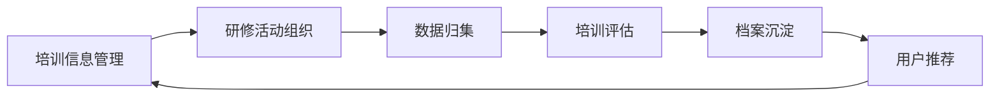
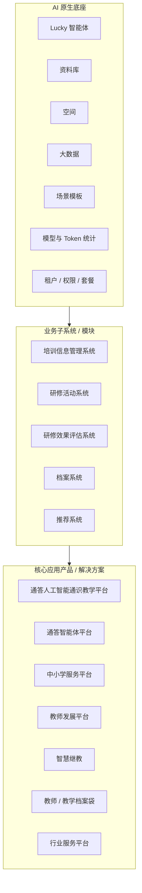
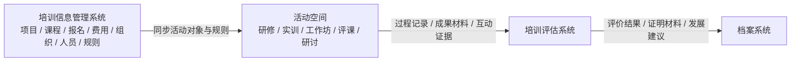
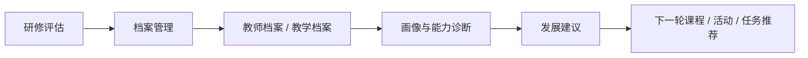
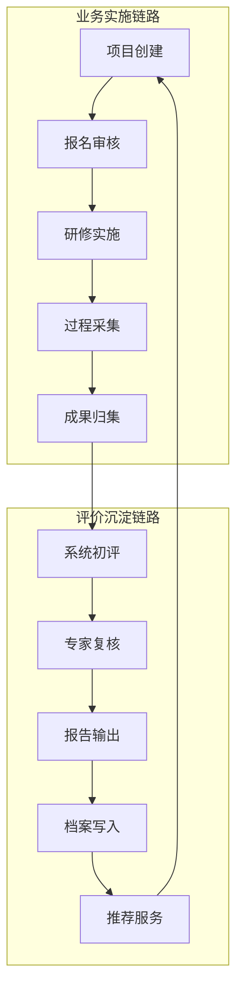

# 新一代“通答 AI 原生培训平台”架构与产品规划

> 本文根据现有 PPT 内容与用户提供的“新一代通答 AI 原生培训平台架构规划蓝图”整理。  
> 核心口径：平台不重新定义培训、研修、评课、评估、档案和推荐等业务本身，而是以 AI 原生平台重新定义这些业务的组织方式、运行方式、数据沉淀方式和产品化交付方式。

## 1. 规划口径

### 1.1 平台定位

新一代“通答 AI 原生培训平台”不是传统培训管理系统加 AI 插件，而是基于果仁 / 通答 AI 原生底座，将培训信息管理、研修活动、培训评估、教师档案和用户推荐组合为可配置、可沉淀、可复用、可运营的业务解决方案。

其中：

- 培训是泛化概念，不限于狭义课程培训，也包括网络研修、线下实训、工作坊、集体备课、课例研讨、课题研究、课堂反思、教学问题攻关、成果共创等有助于能力发展和组织学习的活动。
- 空间是主要承载各类业务活动的载体，承载成员、权限、任务、资料、智能体、互动、成果和过程数据。
- 培训信息管理系统不是在空间中开展的活动模块，而是单独建设的信息关系系统，用 AI 原生方式管理项目、课程、报名、费用、组织、人员、规则、证书、台账等基础信息。
- 核心应用产品不是孤立系统，而是生长在 AI 原生平台上的解决方案，可按教师发展、智慧继教、行业服务、中小学服务、人工智能通识教学等产品线进行包装。

### 1.2 建设目标

平台建设目标是把一次性的培训项目或研修活动，升级为持续发展的业务闭环：

这个闭环的核心价值是：评价发现问题，推荐推动改进，培训继续提升。

## 2. 面向主体

平台面向四类核心主体：培训机构、组训机构、参训机构以及学员。四类主体既是信息管理系统的服务对象，也是研修活动、评估报告、档案沉淀和推荐服务的主要参与方。

| 主体 | 角色定位 | 主要诉求 |
|---|---|---|
| 培训机构 | 课程 / 项目供给方 | 管理培训产品、讲师、课程资源、费用、证书、项目交付和效果证明 |
| 组训机构 | 培训组织方 | 完成需求收集、项目立项、招生组织、名额分配、通知协调和过程监管 |
| 参训机构 | 派员参加培训的单位 | 完成人员报名、资格审核、费用确认、参训跟踪和结果接收 |
| 学员 | 培训参与者 | 完成报名、确认、缴费 / 资料提交、参训、任务提交、证书和档案查询 |

## 3. 总体架构

### 3.1 架构总览

平台由“AI 原生底座 + 业务子系统 / 模块 + 产品线包装”构成。

### 3.2 子系统关系

图示中的平台不是单一系统，而是由五类系统 / 模块组成：

| 系统 / 模块 | 定位 | 核心输出 |
|---|---|---|
| 培训信息管理系统 | 独立的信息关系系统 | 项目、课程、报名、费用、组织、人员、规则、证书和台账 |
| 研修活动系统 | 空间承载的活动过程系统 | 线上学习、线下实训、网络研修、工作坊、协同研修、成果沉淀 |
| 研修效果评估系统 | 过程数据与结果数据的评价系统 | 评价模型、数据归集、过程评估、结果评估、报告输出 |
| 档案系统 | 个人成长证据和组织资产沉淀系统 | 培训记录、评价结果、成果材料、证书证明、发展建议 |
| 推荐系统 | 基于画像与发展目标的供给系统 | 课程推荐、活动推荐、资源推荐、专家推荐、发展路径推荐 |

## 4. 培训信息管理系统产品规划

### 4.1 系统定位

培训信息管理系统负责管理培训业务的基础信息关系，不直接承载研修活动现场。它解决的是“谁组织、谁供给、谁参加、参加什么、按什么规则参加、产生什么台账”的问题。

系统的核心价值是先把招生、费用、项目、课程、人员、组织和权限等基础信息标准化，再支撑后续研修活动组织、数据归集、培训评估和档案沉淀。

### 4.2 核心模块

| 模块 | 产品能力 |
|---|---|
| 招生 / 报名 | 报名入口、定向邀请、公开报名、批量导入、资格审核、名额控制、名单确认 |
| 费用管理 | 收费规则、费用确认、缴费状态、结算管理、费用台账、对账导出 |
| 项目管理 | 项目立项、项目周期、项目计划、课程安排、班级 / 分组、负责人和实施状态 |
| 课程 / 资源管理 | 课程目录、课件资料、案例资源、任务单、测验材料、资料库编目和标签 |
| 组织与人员管理 | 培训机构、组训机构、参训机构、学员、讲师、专家、管理员、身份标签 |
| 规则与权限 | 准入规则、报名规则、证书规则、学分规则、资料访问范围、账号有效期 |
| 证书与证明 | 证书模板、证明模板、发放规则、发放台账、查询核验 |
| 台账与报表 | 招生台账、费用台账、项目台账、人员台账、参训台账、证书台账 |
| AI 辅助管理 | 项目方案生成、课程计划生成、通知生成、报名问答、名单核对、资源自动编目 |

### 4.3 面向四类主体的功能规划

| 主体 | 信息管理能力 | 典型页面 / 操作 |
|---|---|---|
| 培训机构 | 管理培训产品、项目、课程、讲师、资源、费用、证书和交付结果 | 产品目录、项目库、课程库、讲师库、资源库、费用台账、证书模板 |
| 组训机构 | 管理培训需求、项目立项、参训范围、名额分配、通知协调和过程监管 | 项目立项、招生配置、名额分配、报名审核、通知中心、项目看板 |
| 参训机构 | 管理本单位报名人员、资格确认、费用确认、参训进度和结果接收 | 单位报名台账、人员审核、缴费确认、进度查看、证书 / 报告接收 |
| 学员 | 管理个人报名、资料提交、参训确认、任务记录、证书和档案查询 | 我的报名、我的课程、我的任务、我的证书、我的档案、推荐学习 |

### 4.4 与空间的关系

培训信息管理系统在活动前建立对象、规则和台账。当某个培训项目或研修活动需要进入过程运营时，系统将活动、人员、资源、规则和智能体配置同步到对应空间。

## 5. 研修活动系统规划

### 5.1 系统定位

研修活动系统以空间为主要载体，支撑线上线下一体化、研训一体化。它不只是“看课和交作业”，而是把培训、教学研究、协同实践和成果沉淀组织在统一空间中。

### 5.2 网络研修

网络研修同时覆盖“训”和“研”：

- 训：组织培训、课程学习、实训任务、在线作业、进度追踪。
- 研：集体备课、课例研讨、课题研究、课堂反思、教学问题攻关、成果共创。

网络研修模块能力包括：

- 课程学习管理：视频、文档、AIGC 内容、资料导学。
- 直播研修：同步课堂、直播互动、回放沉淀。
- 研讨互动：话题发帖、评论、小组交流、专家点评。
- 任务 / 作业：任务发布、作业提交、互评打分、成果归档。
- 学习轨迹：学习进度、访问记录、互动记录、任务完成记录。

### 5.3 线下研修

线下研修主要支撑集中培训、工作坊、现场实训和教研活动：

- 线下实训活动创建与日程安排。
- 现场签到和身份核验。
- 分组研讨和任务分发。
- 实训任务单、现场资料、工具和智能体配置。
- 现场成果上传、活动纪实归档。
- 线下有效学时采集。

### 5.4 空间底座支撑

研修活动系统底座由空间、资料库、智能体和大数据共同支撑：

- 空间承载成员、权限、流程、任务、互动和成果。
- 资料库沉淀课程、案例、制度、任务单、成果和评价材料。
- 智能体提供资料问答、课程导学、实操指导、研讨纪要、成果摘要和改进建议。
- 大数据归集学习、互动、任务、签到、成果、评价等过程数据。

## 6. 培训评估系统规划

### 6.1 系统定位

培训评估系统不只是“打分和出报告”，而是基于过程数据、成果表现和专家判断，形成诊断、反馈、改进一体化的评价闭环。

### 6.2 核心模块

| 模块 | 内容 |
|---|---|
| 评价模型 | 发展模型 / 能力模型、评价维度、指标体系、权重规则、等级标准、评价主体、模型版本 |
| 数据归集 | 基础数据、过程数据、成果数据、评价数据、证书数据和时间窗口 |
| 评估分析 | 个人评估、班级评估、项目评估、机构评估、区域评估、趋势分析 |
| 报告输出 | 个人评价报告、班级报告、项目总结报告、机构报告、区域分析报告 |
| AI 辅助 | 证据整理、指标匹配、报告草稿、缺项提示、改进建议 |
| 人工确认 | 专家和管理员确认评分、等级、评语和最终结论 |

### 6.3 评价口径

- 过程评估：签到、互动、任务、问卷、课堂行为、研讨行为、学习轨迹等过程表现。
- 结果评估：成果质量、专家评审、满意度、能力达成、学时学分、证书证明等结果表现。
- 综合评价：按模型规则形成个人、班级、项目、学校、机构和区域层面的综合评价。

AI 在评估中只做证据整理、建议稿生成和缺项提示，不替代专家复核，不直接给出高风险评价结论。

## 7. 档案系统规划

### 7.1 系统定位

档案系统不只是“存材料”，而是把培训过程、评价结果、证书成果和发展建议沉淀为可追踪、可复盘、可展示、可授权共享的成长资产。

### 7.2 核心能力

- 档案管理：归集培训记录、研修记录、评估结果、证书证明和成果材料。
- 证据池：沉淀签到、互动、任务、作业、点评、成果、评价和 AI 使用记录。
- 分析推荐：基于评价结果和成长轨迹识别能力短板、优势项和发展阶段。
- 发展建议：将评估报告中的改进建议写入个人成长档案。
- 岗位序列衔接：按初任、胜任、骨干、带头、专家等阶段建立能力发展路径。

## 8. 推荐系统规划

### 8.1 系统定位

推荐系统不是简单“推内容”，而是基于用户画像、能力短板、学习行为和发展目标，提供个性化的课程、任务、专家、资源和发展路径推荐。

### 8.2 分层结构

| 层级 | 说明 |
|---|---|
| 数据接入层 | 接入信息台账、空间过程、评价结果、档案数据、资源数据 |
| 用户画像层 | 形成用户画像、岗位阶段、能力短板、兴趣偏好和学习行为特征 |
| 推荐策略层 | 配置推荐规则、优先级、适配场景和触达策略 |
| 推荐内容层 | 课程、活动、资源、专家、任务、案例、路径 |
| 推荐展示层 | 在学员端、管理端、项目端和空间端展示推荐结果 |
| 反馈优化层 | 根据点击、报名、完成、评价和后续表现优化推荐策略 |

## 9. AI 原生业务模式

### 9.1 不是业务重命名，而是业务模式重构

平台不重新定义培训、研修、评课、档案和评估这些业务，而是将它们放入 AI 原生的运行模式中：

- 信息先被建模：培训项目、课程、人员、组织、规则、证书和台账成为结构化对象。
- 活动进入空间：课程学习、研讨、评课、工作坊、网络研修、线下实训等进入空间运行。
- 数据自动归集：签到、学习、互动、任务、成果、点评、评价等过程数据形成证据链。
- 评估形成反馈：评价模型将过程证据和结果表现转化为报告、等级、建议和证明。
- 档案长期沉淀：结果进入教师 / 学员档案，形成成长资产。
- 推荐推动改进：基于画像和能力差距，推荐下一轮课程、活动、资源和路径。

### 9.2 底座能力

| 底座能力 | 作用 |
|---|---|
| Lucky 智能体 | 面向不同角色提供问答、生成、分析、任务辅助和流程推进能力 |
| 资料库 | 沉淀课程、案例、制度、成果、评价材料，形成可检索、可问答、可生成的知识资产 |
| 空间 | 承载成员、权限、任务、流程、协同、工具和成果，是业务过程的统一载体 |
| 场景模板 | 将培训项目、工作坊、网络研修、AI 通识教学等场景预配置为可复制空间 |
| 模型与 Token 统计 | 计量 AI 调用、Token 消耗和业务归属，支撑成本核算、用量预警和套餐设计 |
| 租户与套餐 | 支持区域、学校、培训机构、行业客户等主体独立运营和组合交付 |

## 10. 产品线与包装工具

### 10.1 产品线

基于 AI 原生平台和上述业务子系统，可包装形成多条产品线：

- 通答人工智能通识教学平台。
- 通答智能体平台。
- 中小学服务平台。
- 教师发展平台。
- 智慧继教。
- 教师 / 教学档案袋。
- 行业服务平台。
- 其他面向不同场景的解决方案产品。

### 10.2 包装工具

| 工具 | 说明 |
|---|---|
| 场景模板 | 将标准业务场景沉淀为可复制的空间模板、信息模型和评估指标 |
| 解决方案配置 | 面向不同客户组合信息管理、活动空间、评估、档案和智能体能力 |
| 多原子组件 | 报名、审核、任务、签到、问卷、证书、报表、推荐等能力开箱即用 |
| AI 原生开发模式 | 用 AI 辅助需求理解、方案整理、代码生成、测试验证和快速迭代 |
| 智搭 AI 开发套件 | 面向场景快速组装页面、流程、智能体和数据能力 |
| Token 商业模式 | 将 AI 调用、模型消耗、场景、租户和业务成果关联计量 |
| 私有化轻量部署 | 支持效率高、成本低、可按客户边界独立部署和运营 |

## 11. 数据流转链路

完整链路从项目创建开始，到推荐服务结束，再回到下一轮培训供给。

## 12. 建设路径

| 阶段 | 建设重点 | 交付成果 |
|---|---|---|
| V1 信息管理闭环 | 建设项目、课程、组织、人员、报名、费用、规则、学分 / 证书和台账 | 培训信息管理系统 MVP |
| V2 活动空间运营 | 将课程、研讨、评课、工作坊、网络研修、线下实训等活动进入空间 | 标准活动空间模板与过程记录 |
| V3 AI 原生增强 | 引入信息建模、资料问答、空间问答、研讨纪要、评课分析和运营预警 | 智能体矩阵与 AI 辅助工作流 |
| V4 效果运营 | 建设评价模型、数据归集、报告输出、档案写入和评估驾驶舱 | 培训评估系统与档案闭环 |
| V5 解决方案复制 | 面向教发、继教、行业服务、中小学服务等场景套餐化 | 产品线、场景包、商业化套件 |

## 13. 治理与边界

| 领域 | 治理要求 |
|---|---|
| 权限隔离 | 按租户、项目、信息对象、空间、活动、角色、来源组织和资料范围控制访问 |
| 质量审核 | AI 生成的信息结构、空间模式、报名问答、报告、证书 / 证明和评价建议进入人工确认 |
| 成本治理 | 按租户、项目、解决方案、空间、活动、人数、智能体和模型统计 Token 消耗 |
| 数据沉淀 | 信息台账、空间参与记录、成果、证书 / 证明和效果报告进入档案 |
| 报告合规 | 个人报告、机构报告、区域报告按权限输出，跨组织报告进行脱敏 |

## 14. 总结

新一代“通答 AI 原生培训平台”的核心不是把现有培训业务重新命名，而是通过 AI 原生底座重构业务运行方式：

- 信息管理系统负责独立管理培训信息关系。
- 空间负责承载研修活动、工作坊、评课、实训和协同过程。
- 培训评估系统负责把过程数据和成果数据转化为可解释结果。
- 档案系统负责把评价结果、证明材料和发展建议沉淀为成长资产。
- 推荐系统负责把评价发现转化为下一轮精准供给。
- 产品线负责把底座能力和业务模块包装为可交付、可复制、可商业化的解决方案。

最终形成“AI 原生底座 + 信息关系系统 + 活动空间 + 评估档案推荐闭环 + 产品线包装”的平台化能力。
