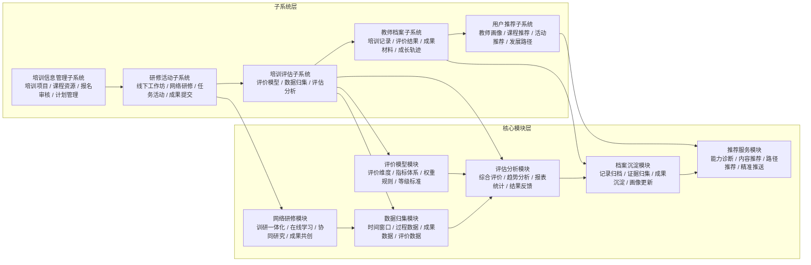
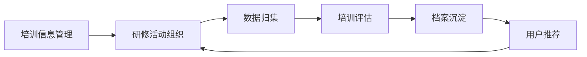
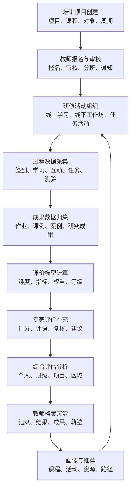
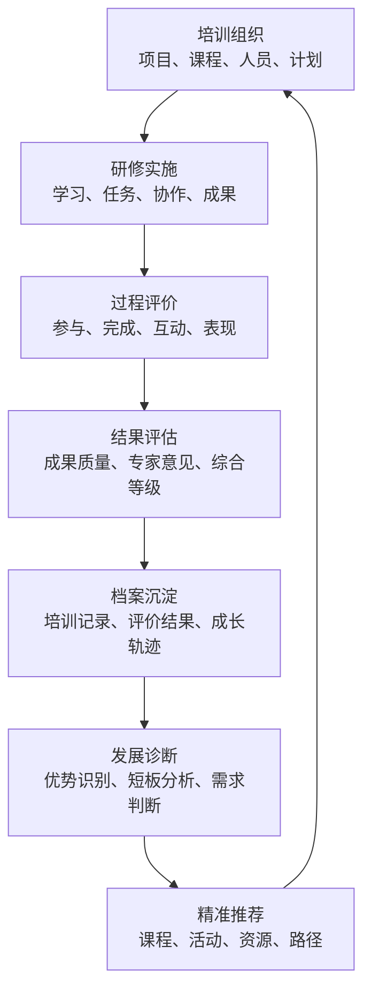

# 培训平台建设方案

## 1. 建设背景

随着教师培训、网络研修、校本研修和专题项目的持续开展，培训业务逐步从“活动组织”走向“过程管理、效果评价和持续发展支持”。传统培训管理方式通常以报名、签到、课程学习和结果统计为主，难以完整呈现教师在培训过程中的参与表现、成果产出、能力变化和后续发展需求。

为提升培训管理的系统化、数据化和精细化水平，拟建设一体化培训平台。平台围绕“培训信息管理、研修活动组织、过程数据归集、培训评估分析、教师档案沉淀、个性化推荐服务”形成闭环，实现培训活动可组织、过程可追踪、结果可评价、档案可沉淀、发展可推荐。

## 2. 建设目标

培训平台建设目标如下：

- 建立统一的培训业务入口，支撑培训项目、课程资源、报名审核、活动组织和过程管理。
- 打通线上研修、线下工作坊、任务活动、课题研究和成果沉淀等培训场景。
- 构建培训评价模型，支持从参与度、完成度、学习表现、成果质量和专家评价等维度开展综合评估。
- 建立教师培训档案，支持自动归集与手动上传培训记录、学习过程、成果材料、评价结果和成长轨迹。
- 基于教师画像和培训评估结果，提供课程、活动、资源和发展路径推荐。
- 为管理部门、学校、培训机构和教师个人提供数据支撑，提升培训治理和教师发展服务能力。

## 3. 总体架构

培训平台采用“子系统 + 核心模块”方式建设。子系统承载业务场景，核心模块提供平台化能力，二者共同形成培训业务闭环。

平台核心闭环为：

## 4. 子系统建设方案

### 4.1 培训信息管理子系统

#### 建设定位

培训信息管理子系统是培训平台的基础业务入口，负责统一管理培训项目、课程资源、培训计划、报名审核和人员组织，为后续研修活动和培训评估提供基础数据。

#### 建设目标

- 统一培训项目和课程资源管理口径。
- 支撑不同类型培训活动的创建、发布和管理。
- 实现教师报名、资格审核、名额管理和参训名单维护。
- 为研修活动、评估分析和档案沉淀提供标准化基础信息。

#### 主要功能

- 培训项目管理：支持项目创建、项目分类、培训对象、培训周期、承办单位和培训要求配置。
- 课程资源管理：支持课程、课件、视频、案例、任务单、测验和成果模板等资源维护。
- 报名审核管理：支持教师报名、单位审核、名单确认、名额控制和报名结果通知。
- 培训计划管理：支持培训日程、课程安排、专家安排、活动安排和阶段任务设置。
- 角色权限管理：支持管理员、培训负责人、专家、教师和学校管理者等角色协同。
- 通知公告管理：支持培训通知、任务提醒、审核反馈和结果公示。

#### 与平台其他部分的关系

该子系统向研修活动子系统提供项目、课程、人员和计划数据；向培训评估子系统提供培训对象、培训周期和评价范围；向教师档案子系统提供培训基础记录。

#### 建设成效

建成后可实现培训项目统一发布、课程资源统一维护、参训人员统一管理，减少重复填报和人工统计，提高培训组织效率。

### 4.2 研修活动子系统

#### 建设定位

研修活动子系统是培训过程的主要承载空间，支持线下工作坊、网络研修、专题任务、协作活动、作业提交和成果展示，形成可记录、可追踪、可评价的培训过程。

#### 建设目标

- 支撑线上、线下和混合式培训活动组织。
- 记录教师在培训过程中的学习、互动、任务和成果数据。
- 支撑培训负责人、专家和教师围绕任务开展协同研修。
- 为培训评估和教师档案提供过程性数据来源。

#### 主要功能

- 线下工作坊：支持签到、分组、活动安排、现场任务、专家点评和成果提交。
- 网络研修：支持在线课程学习、资料阅读、视频学习、讨论互动和在线测验。
- 任务活动：支持阶段任务、个人作业、小组协作、课例打磨和成果共创。
- 作业成果：支持成果提交、材料附件、版本记录、专家批阅和优秀成果展示。
- 互动交流：支持主题讨论、问答交流、同伴互评、专家答疑和活动反馈。
- 过程记录：记录学习时长、参与次数、任务完成情况、互动质量和成果提交情况。

#### 与平台其他部分的关系

该子系统接收培训信息管理子系统的项目和课程安排，产生过程数据并进入数据归集模块；活动结果进入培训评估子系统，成果材料进入教师档案子系统。

#### 建设成效

建成后可将培训活动从单纯组织管理升级为全过程管理，帮助管理者掌握参训状态，帮助教师沉淀研修成果。

### 4.3 培训评估子系统

#### 建设定位

培训评估子系统是培训平台的评价分析能力中心，负责基于评价模型和过程数据，对培训参与、任务完成、学习表现、成果质量和专家评价进行综合分析。

#### 建设目标

- 建立统一、可配置的培训评价模型。
- 支持过程评价、结果评价和综合评价。
- 形成教师个人、培训班级、培训项目和区域层面的评价结果。
- 为教师档案和后续推荐提供可信评价依据。

#### 主要功能

- 评价模型配置：支持评价维度、指标项、权重、评分规则和等级标准配置。
- 评价对象管理：支持按教师、班级、项目、学校和区域组织评价对象。
- 过程评价：基于签到、学习、互动、任务、测验和成果提交等数据进行过程分析。
- 专家评价：支持专家评分、文字评语、等级认定、复核和评价意见汇总。
- 综合评估：汇总自动数据和人工评价，形成综合结果、等级建议和问题提示。
- 报告生成：支持个人报告、班级报告、项目报告和管理统计报告。

#### 与平台其他部分的关系

该子系统从研修活动子系统和数据归集模块获取过程数据，从评价模型模块获取评价规则，并将评估结果写入教师档案子系统，同时为用户推荐子系统提供能力短板和发展建议依据。

#### 建设成效

建成后可提升培训评价的规范性、透明度和可追溯性，减少人工汇总压力，为培训质量改进提供数据依据。

### 4.4 教师档案子系统

#### 建设定位

教师档案子系统是培训成果和教师成长记录的沉淀中心，负责归集教师培训经历、学习过程、成果材料、评价结果和能力发展轨迹。

#### 建设目标

- 建立教师个人培训档案。
- 自动沉淀培训活动中的关键记录和成果。
- 支撑教师个人成长回顾、学校管理和区域统计。
- 为用户推荐和后续培训规划提供画像基础。

#### 主要功能

- 培训记录归档：归集教师参加过的培训项目、课程、活动和完成情况。
- 评价结果归档：记录过程评价、综合评价、专家评语和等级结果。
- 成果材料归档：沉淀作业、课例、研究成果、实践记录和优秀案例。
- 学时与证书管理：支持培训学时、结业状态、证书生成和证书查询。
- 成长轨迹展示：按时间、项目、能力维度和成果类型呈现发展变化。
- 档案查询统计：支持教师个人、学校和管理部门按权限查询。

#### 与平台其他部分的关系

该子系统接收培训信息、研修活动和培训评估结果，形成教师画像和成长档案，并向用户推荐子系统提供历史记录、能力表现和发展需求。

#### 建设成效

建成后可实现培训成果长期沉淀，减少材料重复提交，帮助教师形成连续性的专业发展记录。

### 4.5 用户推荐子系统

#### 建设定位

用户推荐子系统是培训平台的个性化服务能力，基于教师画像、培训记录、评价结果和能力短板，为教师推荐适合的课程、活动、资源和发展路径。

#### 建设目标

- 从统一培训服务转向个性化发展支持。
- 根据教师实际情况推荐培训内容和后续行动。
- 帮助管理者进行分层分类培训组织。
- 提升培训资源利用率和教师参训匹配度。

#### 主要功能

- 教师画像：综合教师基础信息、任教学科、岗位角色、培训经历和评价结果形成画像。
- 能力诊断：识别教师在培训参与、成果质量、能力维度和发展阶段上的特点。
- 课程推荐：根据画像和短板推荐课程、专题、资源包和学习任务。
- 活动推荐：推荐工作坊、网络研修、课题研究、成果共创和专家指导活动。
- 路径推荐：形成阶段性学习路径和发展建议。
- 精准推送：通过消息、待办、推荐卡片等方式触达教师和管理者。

#### 与平台其他部分的关系

该子系统依托教师档案子系统和培训评估结果生成推荐内容，并将推荐结果反馈到研修活动子系统，推动教师进入下一轮培训学习。

#### 建设成效

建成后可提高培训供给与教师需求的匹配度，形成“评价发现问题、推荐推动改进、培训继续提升”的持续发展机制。

## 5. 核心模块建设方案

### 5.1 网络研修模块

#### 建设定位

网络研修模块面向线上学习、协同研究和成果共创场景，强调“训研一体化”，既支持培训课程学习，也支持围绕真实教学问题开展研究、实践和交流。

#### 建设目标

- 支撑教师跨时间、跨空间参与培训和研修。
- 将课程学习、任务实践、课题研究和成果沉淀融合在同一过程中。
- 形成网络研修的过程数据和成果证据。
- 提升培训活动的持续性和参与便利性。

#### 主要功能

- 在线学习：支持课程学习、视频观看、资料阅读、在线测验和学习进度跟踪。
- 研修任务：支持专题任务、阶段任务、实践任务和成果提交。
- 协同研究：支持课题讨论、案例共研、课例打磨和小组协作。
- 资源共创：支持教学设计、课件、案例、反思、研究成果等资源共建。
- 专家指导：支持专家点评、在线答疑、评阅反馈和优秀成果推荐。
- 过程留痕：记录学习时长、访问频次、互动行为、任务完成和成果质量。

#### 与平台其他部分的关系

网络研修模块是研修活动子系统的重要组成部分，向数据归集模块持续输出过程数据，并向档案沉淀模块输出成果材料。

#### 建设成效

建成后可突破线下培训时间和空间限制，提升教师参与度，并将网络研修过程转化为可评价、可沉淀的数据资产。

### 5.2 评价模型模块

#### 建设定位

评价模型模块负责定义培训评价的标准和规则，是培训评估子系统开展评价分析的依据。

#### 建设目标

- 建立统一、可配置、可复用的评价模型。
- 支持不同培训项目根据目标调整评价维度和权重。
- 兼顾过程性表现和结果性成果。
- 支撑评价结果的可解释和可追溯。

#### 主要功能

- 评价维度管理：配置参与度、完成度、学习表现、成果质量、专家评价和成长变化等维度。
- 指标体系管理：为每个维度配置具体指标、计算口径和适用场景。
- 权重规则管理：支持按项目类型、培训对象和评价目的设置权重。
- 等级标准管理：支持优秀、合格、待改进等等级标准配置。
- 评价主体管理：支持自评、互评、专家评价、管理员评价等多主体评价。
- 模型版本管理：支持模型启用、停用、复制和版本追溯。

#### 与平台其他部分的关系

评价模型模块向评估分析模块提供规则依据，结合数据归集模块提供的数据形成评价结果，并支撑培训评估子系统生成报告。

#### 建设成效

建成后可避免评价标准分散和口径不一致的问题，使不同项目的评价既有统一规范，又能保留项目特色。

### 5.3 数据归集模块

#### 建设定位

数据归集模块负责从培训信息、研修活动、网络研修、评价反馈和成果提交等环节采集数据，并按照培训项目和时间窗口进行整理，为评估分析和档案沉淀提供数据基础。

#### 建设目标

- 建立培训全过程数据采集机制。
- 支持按项目、阶段、活动和时间窗口归集过程数据。
- 将分散数据转化为可评价、可统计、可归档的数据资源。
- 提升培训评估和教师档案的数据完整性。

#### 主要功能

- 基础数据归集：归集项目、课程、人员、班级、专家和学校等基础数据。
- 过程数据归集：归集签到、学习时长、课程进度、互动交流、任务完成和测验成绩。
- 成果数据归集：归集作业、课例、案例、研究报告、实践记录和资源共创成果。
- 评价数据归集：归集专家评分、评语、互评结果、问卷反馈和综合评价结果。
- 时间窗口管理：按培训周期、阶段任务、评价节点和统计周期组织数据。
- 数据质量检查：识别缺失数据、异常数据、重复记录和未完成任务。

#### 与平台其他部分的关系

数据归集模块连接培训信息管理、研修活动、网络研修和培训评估，向评估分析模块提供结构化数据，并向档案沉淀模块提供可归档记录。

#### 建设成效

建成后可减少人工汇总和线下统计，实现培训过程数据自动沉淀，为评价分析提供可靠基础。

### 5.4 评估分析模块

#### 建设定位

评估分析模块负责依据评价模型和归集数据，对培训过程、培训结果和培训质量进行综合分析，并输出评价报告和改进建议。

#### 建设目标

- 支撑教师个人、培训班级、培训项目和区域层面的评价分析。
- 形成过程评价、结果评价和综合评价结果。
- 为管理决策、培训优化和教师发展提供数据依据。
- 支持评价结果反馈和后续改进跟踪。

#### 主要功能

- 个人评估：分析教师参与情况、任务完成、成果质量和能力变化。
- 班级评估：分析班级整体学习进度、活跃度、完成率和成果分布。
- 项目评估：分析培训项目目标达成、课程质量、活动效果和评价结果。
- 趋势分析：对比不同阶段、不同项目、不同群体的培训表现。
- 报表统计：生成数据看板、统计表、评价报告和导出材料。
- 结果反馈：向教师、专家、学校和管理部门反馈评价结果和改进方向。

#### 与平台其他部分的关系

评估分析模块读取评价模型和归集数据，输出结果给培训评估子系统、教师档案子系统和用户推荐子系统。

#### 建设成效

建成后可帮助管理者从经验判断转向数据分析，及时发现培训过程问题，持续优化培训内容和组织方式。

### 5.5 档案沉淀模块

#### 建设定位

档案沉淀模块负责将培训过程、评价结果和成果材料转化为教师个人成长档案，形成持续积累、可查询、可复用的培训资产。

#### 建设目标

- 自动沉淀教师培训全过程记录。
- 支撑培训成果、评价结果和能力变化的长期保存。
- 为教师个人发展、学校管理和区域统计提供基础材料。
- 为推荐服务提供稳定的画像数据来源。

#### 主要功能

- 记录归档：归档培训项目、课程学习、活动参与、任务完成和证书学时。
- 证据归集：归集成果材料、专家意见、评价结果和优秀案例。
- 成果沉淀：形成教师个人成果库和培训项目成果库。
- 画像更新：根据新培训记录和评价结果持续更新教师画像。
- 档案展示：以时间轴、项目列表、能力维度和成果类型展示档案内容。
- 权限控制：按教师、学校、培训机构和管理部门设置不同查看范围。

#### 与平台其他部分的关系

档案沉淀模块承接数据归集和评估分析结果，服务教师档案子系统，并向推荐服务模块提供画像基础。

#### 建设成效

建成后可让培训过程不再停留于一次性活动，而是持续转化为教师发展资产和管理决策依据。

### 5.6 推荐服务模块

#### 建设定位

推荐服务模块负责根据教师画像、历史培训记录、评价结果和发展需求，为教师和管理者提供个性化培训推荐。

#### 建设目标

- 提升培训资源与教师发展需求的匹配度。
- 支撑教师分层分类培养。
- 推动培训评价结果转化为后续改进行动。
- 形成培训平台持续服务能力。

#### 主要功能

- 推荐规则配置：支持按岗位、学科、能力短板、培训阶段和评价结果设置推荐规则。
- 内容推荐：推荐课程、资源、案例、专家、活动和专题任务。
- 路径推荐：根据教师阶段和能力需求形成连续学习路径。
- 管理推荐：为学校和管理部门推荐重点关注对象、培训主题和组织策略。
- 推荐反馈：记录推荐曝光、点击、参与和完成情况，用于优化推荐效果。
- 精准触达：通过消息中心、待办事项、首页推荐和培训通知进行推送。

#### 与平台其他部分的关系

推荐服务模块基于教师档案和培训评估结果生成推荐内容，并将推荐结果导入研修活动子系统，形成新一轮培训参与。

#### 建设成效

建成后可从“统一供给”升级为“按需服务”，帮助教师明确后续发展方向，也帮助管理者提升培训组织精准度。

## 6. 培训数据流转设计

培训平台的数据流转围绕培训全过程展开，从项目创建到教师报名，从活动参与到评价分析，再到档案沉淀和推荐服务，形成完整数据链路。

数据流转重点包括：

- 基础数据来源于培训信息管理子系统。
- 过程数据来源于研修活动子系统和网络研修模块。
- 评价数据来源于评价模型模块、评估分析模块和专家评价过程。
- 档案数据来源于培训记录、成果材料和综合评估结果。
- 推荐数据来源于教师画像、历史档案和能力诊断结果。

## 7. 平台闭环机制

培训平台以“培训、评价、档案、推荐”为核心闭环，推动教师培训由阶段性项目转向持续性发展服务。

闭环机制体现为：

- 培训组织提供业务起点。
- 研修实施产生过程数据和成果材料。
- 培训评估形成评价结果和改进建议。
- 教师档案沉淀个人成长证据。
- 用户推荐推动教师进入下一轮精准培训。

## 8. 建设阶段

### 第一阶段：基础平台与培训管理建设

建设培训信息管理子系统，完成项目管理、课程资源、报名审核、人员组织和培训计划等基础功能，形成统一培训业务入口。

### 第二阶段：研修活动与网络研修建设

建设研修活动子系统和网络研修模块，支持线上、线下和混合式培训活动，完成学习、任务、互动、成果提交和专家指导等过程管理能力。

### 第三阶段：数据归集与培训评估建设

建设评价模型模块、数据归集模块和评估分析模块，形成培训过程数据采集、评价模型配置、综合分析和报告输出能力。

### 第四阶段：教师档案与推荐服务建设

建设教师档案子系统、档案沉淀模块和推荐服务模块，实现培训记录归档、评价结果沉淀、教师画像生成和个性化推荐。

### 第五阶段：试点运行与持续优化

选择典型培训项目开展试点，验证培训组织、数据采集、评价分析、档案沉淀和推荐服务闭环，根据试点反馈优化指标体系、业务流程和平台体验。

## 9. 预期成效

培训平台建成后，预期形成以下成效：

- 培训管理更加统一，项目、课程、人员、活动和结果可集中管理。
- 培训过程更加透明，教师学习、互动、任务和成果可持续留痕。
- 培训评价更加科学，过程评价和结果评价相结合，评价依据更加充分。
- 教师档案更加完整，培训记录、成果材料和成长轨迹自动沉淀。
- 培训推荐更加精准，能够根据教师画像和评价结果推送适合的发展资源。
- 管理决策更加有据，支持学校、培训机构和管理部门开展培训质量分析与持续改进。

## 10. 总结

培训平台以培训业务管理为基础，以研修活动组织为载体，以数据归集和培训评估为核心能力，以教师档案为沉淀，以用户推荐为延伸，构建“培训信息管理、研修活动组织、数据归集、培训评估、档案沉淀、用户推荐”的一体化闭环。

通过平台建设，可有效提升培训组织效率、过程管理能力、评价分析质量和教师发展服务水平，为教师专业成长和培训治理现代化提供持续支撑。
